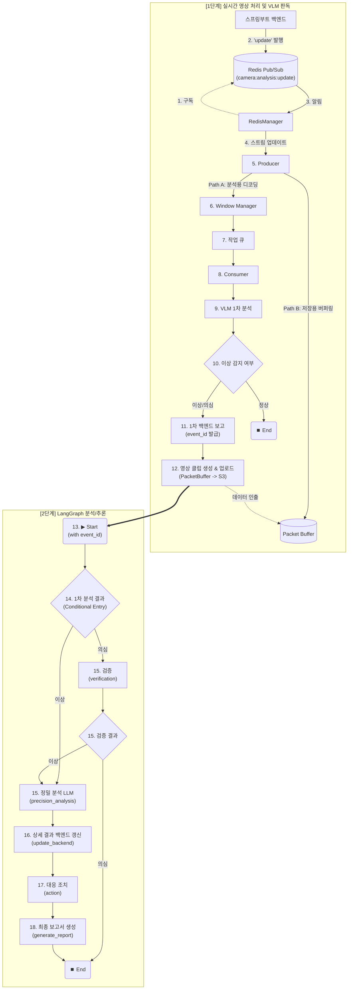

# AEGIS AI Agent

**LangGraph-based Triggered Analytics Pipeline - LangGraph 기반 조건부 분석 시스템**

**스프링부트 백엔드**가 Redis에 등록한 카메라 목록을 동적으로 관리하며, 실시간 영상 프레임을 **LangGraph 기반 파이프라인**으로 처리하여 VLM 분석, 백엔드 보고, 조건부 정밀 분석(LLM) 및 다단계 추론을 수행하는 시스템입니다.

## 🛠️ 기술 스택

| 분류 | 기술 | 비고 |
|------|------|------|
| Language | Python 3.12+ | 최신 문법 및 안정적인 멀티스레딩 |
| Framework | LangGraph 0.2+, LangChain Core | 상태 기반 지능형 워크플로우 제어 |
| API | FastAPI, Uvicorn | 에이전트 제어 및 실시간 상태 모니터링 |
| **영상처리** | **PyAV (av)** | 패킷 레벨 제어 및 재인코딩 없는 초고속 Muxing |
| **저장소** | **Boto3 (S3 / MinIO)** | 증거 영상 클립 저장 및 관리 |
| 캐시 | Redis | 동적 카메라 설정 동기화 및 Pub/Sub 알림 |
| HTTP | requests | 백엔드 및 AI 서버(VLM/LLM) 통신 |

---

## 🎯 시스템 개요

### 핵심 개념
- **하이브리드 아키텍처**: 고성능 실시간 영상 수집(PyAV 스레딩)과 지능형 상태 기반 추론(LangGraph)의 결합.
- **패킷 기반 하이브리드 파이프라인**: 
    - **분석 경로**: 비디오 패킷을 디코딩하여 VLM/LLM 분석용 이미지로 변환.
    - **저장 경로**: 원본 패킷을 메모리(`PacketBuffer`)에 30초간 유지, 이벤트 발생 시 즉시 클립 추출.
- **Keyframe Back-tracking**: 영상 추출 시 요청 시점 이전의 가장 가까운 **I-Frame**을 자동 탐색하여 화면 깨짐 없는 클린한 시작점 보장.
- **Zero-reencoding Remuxing**: 추출된 패킷을 재인코딩 없이 MP4로 변환(PTS/DTS Rescaling 포함)하여 CPU 부하를 최소화하고 원본 화질 유지.
- **3단계 백엔드 보고 체계**: 
    1. **이벤트 생성(POST)**: 이상 감지 즉시 `event_id` 발급 및 초기 상황 전송.
    2. **영상 클립 업데이트(PATCH)**: S3 업로드 완료 후 영상 경로(`clipUrl`) 동기화.
    3. **정밀 분석 최종 보고(PATCH)**: LangGraph 최종 추론 결과로 이벤트 상세 정보 갱신.
- **Redis 기반 동적 오케스트레이션**: 백엔드의 명령에 따라 분석 대상 카메라를 실시간으로 추가/제거 (Restart-less).

---

## 📂 프로젝트 구조

```
src/
├── __init__.py
├── app.py                  # 메인 진입점 (FastAPI + AegisAgent 오케스트레이터)
├── config.py               # 중앙 설정 관리 (Config 데이터클래스)
├── utils.py                # 공용 유틸리티 (로깅, 시그널 핸들러, 지수 백오프)
├── api/
│   ├── api_server.py       # 독립 실행용 FastAPI 서버 (app.py와 중복 - 미사용)
│   └── mock_server.py      # 통합 테스트용 Mock 서버 (VLM/LLM/Backend)
├── clients/
│   ├── backend_client.py   # 스프링부트 백엔드 연동 (이벤트 생성/갱신/클립 업로드)
│   ├── precision_client.py # 정밀 분석 LLM 서버 연동
│   ├── vlm_client.py       # VLM 분석 서버 연동
│   └── vector_store_client.py # RAG용 Vector DB 연동 (미구현 - 빈 클래스)
├── core/
│   ├── producer.py         # PyAV 기반 RTSP 패킷 수집 (분석/저장 이원화)
│   ├── packet_buffer.py    # 30초 원형 버퍼 및 키프레임 백트래킹
│   ├── muxer.py            # MP4 Remuxing (faststart, edts 제거, 해상도 패치)
│   ├── consumer.py         # VLM 분석 + 클립 생성 + LangGraph 실행
│   ├── queue_manager.py    # 오버플로우 보호 작업 큐
│   ├── windowing.py        # 프레임 슬라이딩 윈도우 생성기
│   └── redis_manager.py    # Redis Pub/Sub 기반 카메라 동적 동기화
├── graph/
│   ├── analysis_graph.py   # LangGraph 워크플로우 빌더 및 컴파일
│   ├── state.py            # 파이프라인 전역 상태 (AnalysisState TypedDict)
│   ├── nodes/
│   │   ├── verification.py     # 검증 노드 (미구현 - 임시 ABNORMAL 반환)
│   │   ├── precision_analysis.py # 정밀 분석 LLM 호출
│   │   ├── update_backend.py   # 백엔드 이벤트 갱신
│   │   ├── action.py           # 대응 조치 결정 (미구현 - 빈 리스트 반환)
│   │   └── generate_report.py  # 보고서 생성 (미구현)
│   └── edges/
│       └── routers.py      # 조건부 분기 (analysis_router, verification_router)
├── retrieval/              # RAG 모듈 (미구현)
│   ├── indexer.py          # 문서 인덱싱 (미구현 - 경고 로그만)
│   └── retriever_factory.py # Retriever 팩토리 (미구현 - None 반환)
└── tools/                  # 분석 보조 도구 (미구현)
    └── search_tools.py     # 매뉴얼/사례 검색 (미구현 - 하드코딩 문자열)
```

---

## 🧩 주요 컴포넌트 역할

- **`Producer` (수집가)**: RTSP 스트림을 PyAV로 수신하여 두 경로로 처리합니다.
  - **Path A (분석)**: 패킷을 디코딩하여 JPG 이미지 생성 → WindowManager로 전달
  - **Path B (저장)**: 원본 패킷을 PacketBuffer에 30초간 보관
- **`PacketBuffer` (저장소)**: 최근 30초의 패킷을 deque로 보유하며, 클립 추출 시 **키프레임 역추적**으로 시작점 품질 보장.
- **`Muxer` (포장공)**: 패킷을 MP4로 변환 (faststart, edts 제거, avc1/tkhd 해상도 패치, stco 오프셋 보정).
- **`Consumer` (중재자)**: ThreadPoolExecutor 기반 워커 풀. VLM 분석 → 백엔드 보고 → 클립 생성/업로드 → LangGraph 실행.
- **`BackendClient` (통신병)**: 이벤트 생성(POST), 분석 결과 갱신(PATCH), presigned URL 요청, 클립 업로드(PUT), 업로드 확인(POST).
- **`RedisManager` (관제탑)**: Redis Pub/Sub으로 카메라 목록 변경 감지 → Producer 동적 추가/제거.

---

## 🚀 설치 및 실행

### 설치

```bash
# 가상환경 생성 및 활성화
python -m venv .venv
source .venv/bin/activate  # Windows: .venv\Scripts\activate

# 의존성 설치 (av, boto3, langgraph 등)
pip install -r requirements.txt
```

### 실행 방법

에이전트는 실행 인자를 통해 Mock 서버 사용 여부를 세밀하게 제어할 수 있습니다.

#### 1. 완전 모의(Mock) 모드 (기본값)
```bash
python -m src.app
```

#### 2. 실제(Real) 서버 운영 모드
```bash
python -m src.app --no-mock
```

#### 3. 하이브리드 모드 (특정 서버만 실제 사용)
```bash
# VLM과 백엔드만 실제 서버 사용
python -m src.app --real-vlm --real-backend
```

---

## 📊 에이전트 상태 모니터링

에이전트 실행 시 **8000번 포트**에서 상태 API가 활성화됩니다.

*   **상태 요약**: `GET /status`
    *   `producers`: 활성 카메라 스트림 수
    *   `consumer_stats`: 평균 VLM 분석 시간, 성공률, 이상 감지 비율 등
    *   `queue_size`: 현재 대기 중인 분석 작업 수

---

## 🔄 상세 워크플로우 (Workflow)

시스템의 전체 동작 흐름은 크게 **실시간 영상 처리**와 **LangGraph 분석/추론** 두 단계로 나뉩니다.

### 1. 개요 다이어그램 (Simple Workflow)
전체적인 처리 단계의 흐름을 간략하게 보여줍니다.



### 2. 상세 다이어그램 (Detailed Workflow with Data Flow)
각 단계에서 어떤 데이터가 생성되고 전달되는지를 상세하게 보여줍니다.

> **범례**: ⬜ 처리 단계(Process) | 🟦 데이터 객체(Data) | 🟧 외부 시스템(External)

```mermaid
graph TD
    %% 다크 테마 스타일 정의
    classDef proc fill:#2d2d2d,stroke:#9e9e9e,stroke-width:2px,color:#ffffff;
    classDef data fill:#1a237e,stroke:#5c6bc0,stroke-width:2px,stroke-dasharray: 5 5,color:#ffffff;
    classDef ext fill:#3e2723,stroke:#ffab91,stroke-width:2px,color:#ffffff;
    classDef router fill:#004d40,stroke:#4db6ac,stroke-width:2px,color:#ffffff;

    subgraph RealTime["[1단계] 동적 설정 및 실시간 영상 처리 (core)"]
        direction TB
        
        %% Node Definitions
        ExtMgr["1. 스프링부트 백엔드 (발행)"]:::ext
        RedisCam[("Redis Storage<br>analysis:cameras")]:::ext
        RedisCh[("2. Redis Pub/Sub (채널)")]:::ext
        RM["3. RedisManager (알림)"]:::proc
        RM_Upd["4. RedisManager (업데이트)"]:::proc
        P["5. Producer (분석/저장 이원화)"]:::proc
        W["6. Window Manager"]:::proc
        Q["7. Queue Manager"]:::proc
        C["8. Consumer"]:::proc
        N1["9. VLM Analysis (1차 분석)"]:::proc
        Router0{"10. 이상 감지?"}:::router
        N2["11. Backend Report (1차 보고)"]:::proc
        Backend["스프링부트 백엔드"]:::ext
        Clip["12. Clip Generation (클립 생성)"]:::proc
        EndLocal(⏹️ End):::proc

        %% Data Definitions
        D_Frames[("Raw Frames<br>[JPEG Bytes...]")]:::data
        D_Window[("Window Data<br>• Frames (List)<br>• Camera Info<br>• Time")]:::data
        D_Risk[("• Risk Level<br>• Event Type")]:::data
        D_Req1[("Request<br>• camera_id<br>• risk<br>• type<br>• occurred_at")]:::data
        D_Res1[("Response<br>• eventId")]:::data

        %% Connections
        ExtMgr -. "설정 SET" .-> RedisCam
        RM -. "구독" .-> RedisCh
        ExtMgr -- "'update' 발행" --> RedisCh
        RedisCh -- "알림" --> RM
        RM -. "목록 조회" .-> RedisCam
        RM -- "변경 감지" --> RM_Upd
        RM_Upd -- "스트림 업데이트" --> P
        P -- "Path A (분석)" --> D_Frames
        P -- "Path B (저장)" --> D_PB[("PacketBuffer<br>(원본 패킷 큐)")]
        D_Frames --> W
        W --> D_Window
        D_Window --> Q
        Q --> C
        C --> N1
        N1 --> D_Risk
        D_Risk --> Router0
        Router0 -- "정상" --> EndLocal
        Router0 -- "의심 / 이상" --> N2
        N2 -.-> D_Req1
        D_Req1 -.-> Backend
        Backend -.-> D_Res1
        D_Res1 ==> Clip
        Clip -. "패킷 인출" .-> D_PB
    end

    subgraph LangGraph["[2단계] LangGraph 분석 및 다단계 추론 (graph)"]
        direction TB

        Clip ~~~ D_Input
        %% Node Definitions
        Router{"14. analysis_router<br>(Conditional Entry)"}:::router
        N_Verify["15. verification<br>(검증 노드)"]:::proc
        N_Precise["15. precision_analysis<br>(정밀 분석 LLM)"]:::proc
        Router2{"16. verification_router"}:::router
        N_Update["17. update_backend<br>(상세 결과 갱신)"]:::proc
        Backend2["18. 스프링부트 백엔드"]:::ext
        N_Action["19. action<br>(대응 조치)"]:::proc
        N7["20. generate_report<br>(최종 보고서 생성)"]:::proc
        EndFinal(⏹️ End):::proc

        %% Data Definitions
        D_Input[("13. LangGraph Input (invoke)<br>• camera_info, frames<br>• vlm_result, event_id<br>• occurred_at")]:::data
        D_Detail[("상세 분석 결과<br>• summary<br>• risk_score")]:::data
        D_Req2[("Request<br>• risk<br>• type<br>• summary<br>• risk_score")]:::data
        D_Actions[("대응 결과")]:::data

        %% Connections
        D_Input --> Router
        Router -- "의심" --> N_Verify
        Router -- "이상" --> N_Precise
        N_Verify --> Router2
        Router2 -- "의심" --> EndFinal
        Router2 -- "이상" --> N_Precise
        N_Precise --> D_Detail
        D_Detail --> N_Update
        N_Update -.-> D_Req2
        D_Req2 -.-> Backend2
        N_Update --> N_Action
        N_Action --> D_Actions
        D_Actions --> N7
        N7 --> EndFinal
    end

    %% Connection between subgraphs
    Clip ==> D_Input
```



### [1단계] 동적 설정 및 실시간 영상 처리 (`core` 패키지)
고성능 처리를 위해 일반적인 Python 멀티스레딩 방식으로 동작하며, `core` 패키지의 모듈들이 담당합니다.

1.  **RedisManager (구독)**: 백엔드로부터 Redis Pub/Sub을 통해 카메라 변경 알림을 수신합니다.
2.  **스프링부트 백엔드 (발행)**: 카메라 설정 변경 시 Redis 채널에 'update' 메시지를 발행합니다.
3.  **RedisManager (알림)**: 발행된 알림을 수신하여 변경 사항을 감지합니다.
4.  **RedisManager (업데이트)**: 최신 카메라 목록을 조회하여 스트림 관리를 수행합니다.
5.  **Producer (분석/저장 이원화)**: 
    *   **Path A (분석)**: 패킷을 프레임으로 디코딩하여 `Window Manager`로 전달합니다.
    *   **Path B (저장)**: 원본 패킷을 `PacketBuffer`에 30초간 유지하며 품질을 보정합니다.
6.  **Window Manager (데이터 구성)**: 수집된 프레임을 분석 단위(윈도우)로 그룹화합니다.
7.  **Queue Manager (작업 적재)**: 생성된 윈도우 데이터를 작업 큐에 적재합니다.
8.  **Consumer (작업 인출)**: 큐에서 작업을 가져와 분석을 시작합니다.
9.  **VLM Analysis (1차 분석)**: VLM을 사용해 위험도(`risk_level`)를 판별합니다.
10. **Router (분기 처리)**: 분석 결과가 정상('NORMAL')이면 종료합니다.
11. **Backend Report (1차 보고)**: 이상/의심 시 즉시 백엔드에 보고하고 `event_id`를 발급받습니다.
12. **Video Clip Generation (영상 클립 생성)**: `event_id`를 기반으로 MP4 클립을 생성하여 S3에 업로드합니다.

### [2단계] LangGraph 분석 및 다단계 추론 (`graph` 패키지)
`Consumer`가 영상 처리를 완료한 후 생성된 `event_id`와 함께 LangGraph 파이프라인을 실행합니다.

13. **그래프 진입 (Entry Point: `invoke`)**:
    *   `camera_info`, `frames`, `vlm_result`, `event_id` 등을 포함한 초기 상태(`AnalysisState`)를 가지고 그래프가 실행됩니다.
14. **조건부 라우팅 (Router: `analysis_router`)**:
    *   그래프의 시작점에서 상태(`risk_level`)에 따라 다음 노드로 분기합니다.
        *   **'NORMAL'**: 종료.
        *   **'SUSPICIOUS'**: '검증' 노드로 진입.
        *   **'ABNORMAL'**: '정밀 분석' 노드로 진입.
15. **검증 (노드: `verification`)** (SUSPICIOUS 경로):
    *   **[작업 예정]** '의심' 상황에 대한 구체적인 검증 로직은 추후 확정될 예정입니다.
16. **검증 후 분기 (엣지: `verification_router`)**:
    *   검증 결과가 **'ABNORMAL'**인 경우에만 '정밀 분석 (LLM)' 노드로 진행합니다.
17. **정밀 분석 (LLM) (노드: `precision_analysis`)**:
    *   `precision_client`를 사용하여 정밀 분석 서버에 프레임 묶음과 `event_id`를 전송합니다.
18. **상세 결과 백엔드 갱신 (노드: `update_backend`)**:
    *   `backend_client`를 사용하여 `event_id`와 함께 상세 분석 결과(`risk`, `type`, `summary`, `risk_score`)를 **스프링부트 백엔드**로 전송합니다.
19. **대응 조치 (노드: `action`)**:
    *   **[작업 예정]** 정밀 분석 결과를 바탕으로 필요한 대응 조치(예: 매뉴얼 검색, 알림 발송 등)를 결정하고 수행합니다.
20. **최종 보고서 생성 (노드: `generate_report`)**:
    *   **[작업 예정]** **RAG(검색 증강 생성)** 기능을 수행하는 노드입니다.
21. **워크플로우 종료 (END)**: 모든 분석이 완료된 최종 `AnalysisState`를 반환하며 그래프 실행이 종료됩니다.

---

## 🤖 LangGraph 파이프라인 상태

### `src/graph/state.py`: AnalysisState 정의

그래프의 모든 노드(단계)가 공유하고 업데이트하는 중앙 데이터 구조입니다. `TypedDict`를 사용하여 각 데이터의 타입을 명확하게 정의합니다.

```python
from typing import TypedDict, List, Optional, Literal, Dict, Any, Union
from datetime import datetime

# 1차 분류: VLM 분석 결과
RiskLevel = Literal["NORMAL", "SUSPICIOUS", "ABNORMAL"]

# 2차 분류: 정밀 분석 이벤트 유형
EventType = Literal["ASSAULT", "BURGLARY", "DUMP", "SWOON", "VANDALISM"]

class AnalysisState(TypedDict):
    """LangGraph 분석 파이프라인의 상태를 정의하는 TypedDict"""

    # --- 초기 입력 ---
    camera_id: str
    camera_name: str
    camera_location: str
    occurred_at: datetime  # 분석 윈도우의 시작 시점
    frames: List[bytes]
    event_id: str
    vlm_result: Dict[str, Any]         # 1차 VLM 분석 원본 결과
    window_start: Union[int, str] # 윈도우 시작 시간 추가
    window_end: Union[int, str]   # 윈도우 종료 시간 추가
    
    # --- 워크플로우 진행 중 생성 ---
    precision_result: Dict[str, Any]   # 2차 정밀 분석 원본 결과
    
    # --- 최종 분석 결과 (워크플로우를 거치며 갱신됨) ---
    risk_level: RiskLevel
    event_type: EventType
    summary: str
    risk_score: float
    report: str             # -- 작업중 -- (보고서 생성 LLM 결과)
    
    # --- 메타 데이터 ---
    actions: list           # -- 작업중 --
    rag_references: list    # -- 작업중 --
    errors: List[str]
```

---

## 🐛 Known Issues

> 최종 감사일: 2026-02-04

### 미구현 코드 (TBD / Placeholder)

| 파일 | 함수/클래스 | 현재 동작 | 설명 |
|------|-------------|----------|------|
| `retrieval/retriever_factory.py` | `create_retriever()` | `None` 반환 + 경고 로그 | RAG Retriever 생성 로직 미구현 |
| `retrieval/indexer.py` | `index_document()` | 경고 로그만 출력 | 문서 임베딩/인덱싱 로직 미구현 |
| `tools/search_tools.py` | `search_manual()` | 하드코딩 문자열 반환 | 대응 매뉴얼 검색 미구현 |
| `tools/search_tools.py` | `search_past_cases()` | 하드코딩 문자열 반환 | 유사 과거 사례 검색 미구현 |
| `clients/vector_store_client.py` | `VectorStoreClient` | `pass` (빈 클래스) | Vector DB 클라이언트 미구현 |
| `graph/nodes/verification.py` | `verification_node()` | 무조건 `{"risk_level": "ABNORMAL"}` 반환 | 검증 로직 미정 - 임시 구현 |
| `graph/nodes/action.py` | `action_node()` | `{"actions": []}` 반환 | 대응 조치 결정 로직 미구현 |
| `graph/nodes/generate_report.py` | `generate_report_node()` | `{"report": "Not Implemented"}` 반환 | RAG 기반 보고서 생성 미구현 |

### 고아 코드 (Orphan Code)

| 파일 | 상태 | 설명 |
|------|------|------|
| `api/api_server.py` | 미사용 | `app.py`에 FastAPI가 통합되어 있어 중복. 독립 실행 시에만 사용 가능하나 현재 미사용 상태. 삭제 또는 통합 검토 필요. |

### 논리적 불일치

| 파일:라인 | 문제 | 영향 |
|-----------|------|------|
| `config.py:19-20` | `_real_vlm_endpoint`, `_real_precision_endpoint`에 `<실제 VLM 서버 IP>` 플레이스홀더 하드코딩 | 운영 배포 시 수정 누락 가능. 환경변수로 전환 권장 |
| `graph/state.py:8` | `EventType = Literal["ASSAULT", "BURGLARY", "DUMP", "SWOON", "VANDALISM"]`에 "UNKNOWN" 미정의 | `precision_analysis.py:44`에서 `"UNKNOWN".upper()` 사용 시 타입 불일치 |
| `config.py:56` | `storage_client.py` 언급되어 있으나 실제 파일 없음 | README/주석과 실제 코드 불일치 (S3 업로드는 backend_client.py에 통합됨) |

### 비효율적 코드

| 파일:라인 | 문제 | 영향 | 권장 조치 |
|-----------|------|------|----------|
| `core/producer.py:196-217` | 모든 패킷을 `packet.decode()`로 디코딩 후 FPS 제어로 대부분 버림 | CPU 낭비 (1fps 설정 시 10fps 스트림에서 90% 버림) | 키프레임 기반 선택적 디코딩 또는 디코딩 스킵 로직 검토 |
| `core/windowing.py:70-92` | `_window_loop`에서 0.1초마다 전체 카메라 버퍼를 `for` 루프로 순회 | 카메라 수 증가 시 CPU 부하 증가 | 이벤트 기반 또는 카메라별 타이머 처리 검토 |
| `core/consumer.py:86-87` | VLM 분석 실패 시 `continue`로 건너뛰지만 실패 원인 상세 로깅 부족 | 디버깅 어려움 | 실패 원인별 상세 로깅 추가 |

### 보안 이슈

| 파일 | 문제 | 심각도 | 권장 조치 |
|------|------|--------|----------|
| `config.py:19-25` | 실제 서버 IP/엔드포인트가 소스코드에 하드코딩 가능 | 🟡 중간 | 환경변수 또는 외부 설정 파일로 분리 |
| `clients/backend_client.py` | 모든 HTTP 통신이 `http://`로 수행 (내부망 가정) | 🟢 낮음 | 운영환경에서 TLS(HTTPS) 적용 필요 |
| `api/mock_server.py` | Mock 서버가 `0.0.0.0`에 바인딩되어 외부 접근 가능 | 🟢 낮음 | 개발환경 전용임을 명시하고 운영환경에서 비활성화 확인 필요 |


