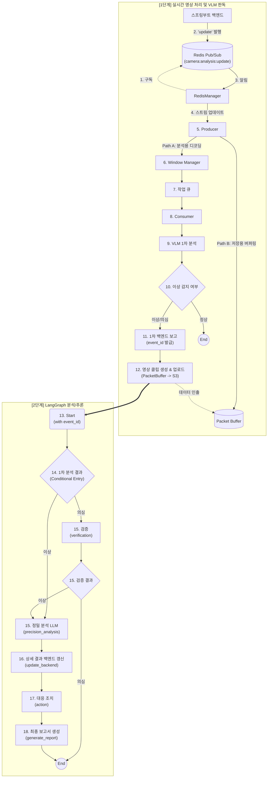

# AEGIS AI Agent

> LangGraph 기반 실시간 영상 분석 파이프라인

## 개요

AEGIS AI Agent는 RTSP 스트림을 실시간으로 수신하여 VLM(Vision Language Model) 분석을 수행하고, 이상 감지 시 LangGraph 기반 다단계 추론 파이프라인을 통해 정밀 분석, 백엔드 보고, 영상 클립 생성을 자동화하는 시스템입니다.

## 기술 스택

| 분류 | 기술 | 버전 | 용도 |
|------|------|------|------|
| Language | Python | 3.12+ | 메인 언어 |
| Framework | LangGraph | 1.0.7 | 상태 기반 워크플로우 |
| Framework | LangChain Core | 1.2.7 | LLM 추상화 |
| API | FastAPI | 0.128.0 | REST API 서버 |
| API | Uvicorn | 0.40.0 | ASGI 서버 |
| 영상처리 | PyAV | 16.1.0 | RTSP 패킷 수신 및 Muxing |
| 영상처리 | OpenCV | 4.13.0 | 프레임 리사이징/인코딩 |
| 캐시 | Redis | 7.1.0 | 카메라 목록 동기화, Pub/Sub |
| HTTP | Requests | 2.32.5 | 백엔드/VLM/LLM 통신 |
| 유효성검사 | Pydantic | 2.12.5 | 데이터 모델 검증 |

## 프로젝트 구조

```
src/
├── __init__.py
├── app.py                      # 메인 진입점 (FastAPI 앱 + AegisAgent 오케스트레이터)
├── config.py                   # Config 데이터클래스 (전체 설정 관리)
├── utils.py                    # 유틸리티 (로깅, 시그널 핸들러, 지수 백오프)
│
├── api/
│   ├── __init__.py
│   ├── api_server.py           # 독립 실행용 FastAPI 서버 (미사용 - app.py에 통합됨)
│   └── mock_server.py          # Mock 서버 (VLM, Precision, Backend)
│
├── clients/
│   ├── __init__.py
│   ├── backend_client.py       # 백엔드 API 클라이언트 (이벤트 CRUD, 클립 업로드)
│   ├── precision_client.py     # 정밀 분석 LLM 클라이언트
│   ├── vlm_client.py           # VLM 분석 클라이언트
│   └── vector_store_client.py  # Vector DB 클라이언트 (미구현)
│
├── core/
│   ├── __init__.py
│   ├── producer.py             # RTSP 패킷 수신 스레드 (PyAV 기반)
│   ├── packet_buffer.py        # 30초 원형 패킷 버퍼 (키프레임 백트래킹)
│   ├── muxer.py                # MP4 Muxing (faststart, edts 제거, 해상도 패치)
│   ├── consumer.py             # 분석 워커 풀 (VLM → 클립 생성 → LangGraph)
│   ├── queue_manager.py        # 오버플로우 보호 작업 큐
│   ├── windowing.py            # 프레임 슬라이딩 윈도우 생성기
│   └── redis_manager.py        # Redis Pub/Sub 기반 카메라 동기화
│
├── graph/
│   ├── __init__.py
│   ├── analysis_graph.py       # LangGraph 워크플로우 빌더
│   ├── state.py                # AnalysisState TypedDict 정의
│   ├── nodes/
│   │   ├── __init__.py
│   │   ├── verification.py     # 검증 노드 (미구현 - 임시 ABNORMAL 반환)
│   │   ├── precision_analysis.py # 정밀 분석 LLM 호출
│   │   ├── update_backend.py   # 백엔드 이벤트 갱신
│   │   ├── action.py           # 대응 조치 결정 (미구현)
│   │   └── generate_report.py  # 보고서 생성 (미구현)
│   └── edges/
│       ├── __init__.py
│       └── routers.py          # 조건부 분기 (analysis_router, verification_router)
│
├── retrieval/                  # RAG 모듈 (미구현)
│   ├── __init__.py
│   ├── indexer.py              # 문서 인덱싱 (미구현)
│   └── retriever_factory.py    # Retriever 팩토리 (미구현)
│
└── tools/                      # 분석 도구 (미구현)
    ├── __init__.py
    └── search_tools.py         # 매뉴얼/사례 검색 (미구현)
```

---

## 핵심 컴포넌트 상세

### app.py - AegisAgent

메인 오케스트레이터 클래스입니다. FastAPI 앱의 lifespan 컨텍스트에서 초기화됩니다.

**주요 속성:**
- `queue_manager`: 분석 작업 큐
- `window_manager`: 프레임 윈도우 관리
- `consumer_pool`: 분석 워커 풀
- `redis_manager`: 카메라 동기화
- `producers`: 카메라별 프로듀서 딕셔너리
- `packet_buffers`: 카메라별 패킷 버퍼
- `source_streams`: 카메라별 스트림 메타데이터

**FastAPI 엔드포인트:**

| Method | Path | 설명 |
|--------|------|------|
| GET | `/health` | 헬스 체크 |
| GET | `/status` | 에이전트 상태 조회 |

---

### config.py - Config

모든 설정을 관리하는 데이터클래스입니다.

**모드 설정:**

| 설정 | 기본값 | 설명 |
|------|--------|------|
| `mock_mode` | `True` | Mock 서버 사용 여부 |
| `real_vlm` | `False` | 실제 VLM 서버 사용 |
| `real_precision` | `False` | 실제 정밀 분석 서버 사용 |
| `real_backend` | `False` | 실제 백엔드 서버 사용 |
| `real_s3` | `False` | 실제 S3 서버 사용 |

**RTSP/프레임 설정:**

| 설정 | 기본값 | 설명 |
|------|--------|------|
| `rtsp_host` | `127.0.0.1` | RTSP 서버 호스트 |
| `rtsp_port` | `8554` | RTSP 서버 포트 |
| `frame_width` | `640` | 분석용 이미지 너비 |
| `frame_height` | `360` | 분석용 이미지 높이 |
| `jpeg_quality` | `60` | JPEG 품질 |
| `fps` | `1` | 분석 FPS |
| `video_buffer_seconds` | `30` | 패킷 버퍼 시간 |

**분석 파이프라인 설정:**

| 설정 | 기본값 | 설명 |
|------|--------|------|
| `num_workers` | `4` | 워커 스레드 수 |
| `window_size` | `8` | 윈도우 프레임 수 |
| `window_slide` | `4` | 윈도우 슬라이드 간격 |
| `flush_timeout` | `30` | 타임아웃 강제 처리 |
| `min_flush_size` | `5` | 강제 처리 최소 프레임 |
| `queue_max_size` | `20` | 큐 최대 크기 |

**네트워크 설정:**

| 설정 | 기본값 | 설명 |
|------|--------|------|
| `vlm_timeout` | `30` | VLM 타임아웃 |
| `precision_timeout` | `60` | 정밀 분석 타임아웃 |
| `backend_timeout` | `10` | 백엔드 타임아웃 |
| `redis_host` | `localhost` | Redis 호스트 |
| `redis_port` | `6379` | Redis 포트 |

---

### core/producer.py - FrameProducer

RTSP 스트림을 수신하는 스레드입니다.

**처리 경로:**
- **Path A (분석)**: 패킷 디코딩 → BGR 이미지 → 리사이즈 → JPEG → WindowManager
- **Path B (저장)**: 원본 패킷을 PacketBuffer에 저장 (디코딩 없음)

**주요 메서드:**
- `_open_stream()`: PyAV로 RTSP 스트림 열기 (TCP 강제, 5초 타임아웃)
- `_preprocess_frame()`: 리사이즈 + JPEG 인코딩
- `run()`: 메인 루프 - 패킷 수신 → 버퍼 저장 → 디코딩 → 분석

---

### core/packet_buffer.py - PacketBuffer

최근 30초 패킷을 저장하는 원형 버퍼입니다.

**주요 메서드:**
- `add_packet()`: 패킷 추가, 오래된 패킷 자동 제거
- `get_full_buffer()`: 키프레임 백트래킹 후 패킷 리스트 반환

**키프레임 백트래킹:**
1. 시작 시점 계산 (현재 - clip_duration)
2. 시작점 이전의 가장 가까운 키프레임 탐색
3. 키프레임부터 끝까지 패킷 리스트 반환

---

### core/muxer.py - MP4 Muxing

패킷을 브라우저 재생 가능한 MP4로 변환합니다.

**mux_packets_to_mp4() 처리 과정:**
1. PyAV로 MP4 컨테이너 생성
2. DTS/PTS 정규화 (0부터 시작, 단조 증가)
3. ftyp 앞 쓰레기 제거
4. faststart 적용 (moov를 mdat 앞으로)
5. edts 박스 제거 (재생 위치 문제 방지)
6. avc1/tkhd 해상도 패치 (PyAV 버그 대응)

**내부 함수:**
- `_find_atom()`: MP4 atom 위치 탐색
- `_patch_stco()`: moov 이동 후 stco/co64 오프셋 재계산
- `_remove_edts()`: edts 박스 제거
- `_patch_resolution()`: avc1/tkhd에 해상도 강제 설정
- `_faststart()`: moov를 mdat 앞으로 이동

---

### core/consumer.py - ConsumerPool

분석 작업을 처리하는 워커 풀입니다.

**워커 처리 흐름:**
1. 큐에서 작업 인출
2. VLM 1차 분석 수행
3. NORMAL이면 종료
4. ABNORMAL/SUSPICIOUS면:
   - 백엔드에 이벤트 생성 (event_id 획득)
   - PacketBuffer에서 패킷 추출
   - mux_packets_to_mp4()로 클립 생성
   - presigned URL로 S3 업로드
   - 클립 업로드 확인
   - LangGraph 파이프라인 실행

**통계:**
- `total_processed`: 처리 완료
- `total_failed`: 실패
- `total_abnormal`: 이상 감지
- `total_normal`: 정상
- `total_vlm_time`: VLM 분석 시간 합계

---

### core/windowing.py - WindowManager

프레임을 슬라이딩 윈도우로 그룹화합니다.

**주요 로직:**
- `add_frame()`: 프레임 추가
- `_window_loop()`: 백그라운드 스레드
  - window_slide 간격마다 윈도우 생성
  - flush_timeout 경과 시 강제 처리

---

### core/queue_manager.py - QueueManager

오버플로우 보호가 있는 작업 큐입니다.

- `put()`: 큐가 가득 차면 가장 오래된 작업 삭제 후 추가
- `get()`: 타임아웃 대기 후 작업 반환

---

### core/redis_manager.py - RedisManager

Redis 기반 카메라 동기화를 담당합니다.

- `get_analysis_cameras()`: analysis:cameras 키에서 카메라 목록 조회
- `_pubsub_loop()`: camera:analysis:update 채널 구독

---

### clients/backend_client.py - BackendClient

백엔드 API 통신을 담당합니다.

| 메서드 | 엔드포인트 | 설명 |
|--------|-----------|------|
| `send_vlm_result()` | POST /internal/agent/events | 이벤트 생성, event_id 반환 |
| `update_event()` | PATCH /internal/agent/events/{id}/analysis | 정밀 분석 결과로 갱신 |
| `get_clip_upload_url()` | GET /internal/agent/events/{id}/clip/upload-url | presigned URL 획득 |
| `upload_clip()` | PUT {presigned_url} | MP4 직접 업로드 |
| `confirm_event_clip()` | POST /internal/agent/events/{id}/clip/confirm | 업로드 완료 확인 |

---

### clients/vlm_client.py - VLMClient

VLM 서버와 통신합니다.

**analyze_frames() 요청:**
- camera_id, frames (base64), timestamp, window_start/end

**응답:**
- risk_level: NORMAL / SUSPICIOUS / ABNORMAL
- event_type: ASSAULT / BURGLARY / DUMP / SWOON / VANDALISM

---

### clients/precision_client.py - PrecisionClient

정밀 분석 LLM 서버와 통신합니다.

**send_for_analysis() 요청:**
- camera_id, frames, vlm_result, occurred_at

**응답:**
- risk, event_type, summary, risk_score

---

### graph/state.py - AnalysisState

LangGraph 파이프라인의 상태 정의입니다.

| 필드 | 타입 | 설명 |
|------|------|------|
| camera_id | str | 카메라 ID |
| camera_name | str | 카메라 이름 |
| camera_location | str | 카메라 위치 |
| occurred_at | datetime | 이벤트 발생 시각 |
| frames | List[bytes] | 프레임 데이터 |
| event_id | str | 백엔드 이벤트 ID |
| vlm_result | Dict | VLM 분석 결과 |
| precision_result | Dict | 정밀 분석 결과 |
| risk_level | RiskLevel | NORMAL/SUSPICIOUS/ABNORMAL |
| event_type | EventType | 이벤트 유형 |
| summary | str | 요약 |
| risk_score | float | 위험도 점수 |
| report | str | 최종 보고서 (미구현) |
| actions | list | 대응 조치 (미구현) |
| rag_references | list | RAG 참조 (미구현) |
| errors | List[str] | 오류 목록 |

---

### graph/analysis_graph.py - build_graph()

LangGraph 워크플로우를 빌드합니다.

```
[Entry Point] → analysis_router
    ├─ NORMAL → END
    ├─ SUSPICIOUS → verification → verification_router
    │                                 ├─ ABNORMAL → precision_analysis
    │                                 └─ else → END
    └─ ABNORMAL → precision_analysis → update_backend → action → generate_report → END
```

---

### api/mock_server.py

개발/테스트용 Mock 서버입니다.

**MockVLMServer (포트 8001):**
- POST /analyze
- 25% ABNORMAL, 25% SUSPICIOUS, 50% NORMAL
- 랜덤 event_type 반환

**MockPrecisionServer (포트 8002):**
- POST /precision_analyze
- risk_score: 0.8~1.0 (이상), 0.0~0.2 (정상)

**MockBackendServer (포트 8088):**
- POST /api/vlm-results → event_id 생성
- PUT /api/vlm-results/{event_id} → 이벤트 갱신

---

## 실행 방법

### 설치

```bash
python -m venv .venv
source .venv/bin/activate
pip install -r requirements.txt
```

### 환경 변수 설정

```bash
cp .env.sample .env
```

`.env` 파일을 열고 아래 값을 채워주세요:

| 변수 | 설명 |
|------|------|
| `OPENAI_API_KEY` | OpenAI API 키 |
| `LANGSMITH_TRACING` | LangSmith 추적 활성화 (`true` / `false`) |
| `LANGSMITH_API_KEY` | LangSmith API 키 ([smith.langchain.com](https://smith.langchain.com)에서 발급) |
| `LANGSMITH_PROJECT` | LangSmith 프로젝트명 |

### 실행

```bash
# Mock 모드 (기본값)
python -m src.app

# 실제 서버 모드
python -m src.app --no-mock

# 하이브리드 모드
python -m src.app --real-vlm --real-backend

# 옵션
--workers N          # 워커 스레드 수
--log-level DEBUG    # 로그 레벨
```

---

## 워크플로우

### 개요 다이어그램



### 전체 흐름

1. RedisManager: camera:analysis:update 채널 구독
2. Redis에서 분석 대상 카메라 목록 조회
3. 카메라별 FrameProducer 스레드 시작
4. Producer: RTSP 패킷 수신
   - Path A: 디코딩 → WindowManager
   - Path B: PacketBuffer에 버퍼링
5. WindowManager: 윈도우 생성 → QueueManager
6. Consumer 워커:
   - VLM 1차 분석
   - NORMAL이면 종료
   - 이상 감지 시: 백엔드 보고 → 클립 생성/업로드 → LangGraph
7. LangGraph: verification → precision_analysis → update_backend → action → generate_report

### 상세 데이터 흐름

```mermaid
graph TD
    classDef proc fill:#2d2d2d,stroke:#9e9e9e,stroke-width:2px,color:#ffffff
    classDef data fill:#1a237e,stroke:#5c6bc0,stroke-width:2px,stroke-dasharray: 5 5,color:#ffffff
    classDef ext fill:#3e2723,stroke:#ffab91,stroke-width:2px,color:#ffffff
    classDef router fill:#004d40,stroke:#4db6ac,stroke-width:2px,color:#ffffff

    subgraph RealTime["[1단계] 동적 설정 및 실시간 영상 처리"]
        direction TB
        
        ExtMgr["1. 스프링부트 백엔드"]:::ext
        RedisCam[("Redis Storage<br>analysis:cameras")]:::ext
        RedisCh[("2. Redis Pub/Sub")]:::ext
        RM["3. RedisManager"]:::proc
        RM_Upd["4. RedisManager"]:::proc
        P["5. Producer"]:::proc
        W["6. Window Manager"]:::proc
        Q["7. Queue Manager"]:::proc
        C["8. Consumer"]:::proc
        N1["9. VLM Analysis"]:::proc
        Router0{"10. 이상 감지?"}:::router
        N2["11. Backend Report"]:::proc
        Backend["스프링부트 백엔드"]:::ext
        Clip["12. Clip Generation"]:::proc

        D_Frames[("Raw Frames<br>[JPEG Bytes...]")]:::data
        D_Window[("Window Data<br>Frames + Camera Info")]:::data
        D_Risk[("Risk Level<br>Event Type")]:::data
        D_Req1[("Request<br>camera_id, risk, type")]:::data
        D_Res1[("Response<br>eventId")]:::data

        ExtMgr -. "설정 SET" .-> RedisCam
        RM -. "구독" .-> RedisCh
        ExtMgr -- "'update' 발행" --> RedisCh
        RedisCh -- "알림" --> RM
        RM -. "목록 조회" .-> RedisCam
        RM -- "변경 감지" --> RM_Upd
        RM_Upd -- "스트림 업데이트" --> P
        P -- "Path A" --> D_Frames
        P -- "Path B" --> D_PB[("PacketBuffer")]
        D_Frames --> W
        W --> D_Window
        D_Window --> Q
        Q --> C
        C --> N1
        N1 --> D_Risk
        D_Risk --> Router0
        Router0 -- "정상" --> EndLocal((End))
        Router0 -- "의심/이상" --> N2
        N2 -.-> D_Req1
        D_Req1 -.-> Backend
        Backend -.-> D_Res1
        D_Res1 ==> Clip
        Clip -. "패킷 인출" .-> D_PB
    end

    subgraph LangGraph["[2단계] LangGraph 분석/추론"]
        direction TB

        D_Input[("13. LangGraph Input<br>camera_info, frames<br>vlm_result, event_id")]:::data
        Router{"14. analysis_router"}:::router
        N_Verify["15. verification"]:::proc
        N_Precise["15. precision_analysis"]:::proc
        Router2{"16. verification_router"}:::router
        N_Update["17. update_backend"]:::proc
        Backend2["스프링부트 백엔드"]:::ext
        N_Action["18. action"]:::proc
        N7["19. generate_report"]:::proc
        EndFinal((End)):::proc

        D_Detail[("상세 분석 결과<br>summary, risk_score")]:::data
        D_Req2[("Request<br>risk, type, summary")]:::data

        D_Input --> Router
        Router -- "의심" --> N_Verify
        Router -- "이상" --> N_Precise
        N_Verify --> Router2
        Router2 -- "의심" --> EndFinal
        Router2 -- "이상" --> N_Precise
        N_Precise --> D_Detail
        D_Detail --> N_Update
        N_Update -.-> D_Req2
        D_Req2 -.-> Backend2
        N_Update --> N_Action
        N_Action --> N7
        N7 --> EndFinal
    end

    Clip ==> D_Input
```



---

## 🐛 Known Issues

> 최종 감사일: 2026-02-05

### 미구현 코드 (TBD / Placeholder)

| 파일 | 함수/클래스 | 현재 동작 |
|------|-------------|----------|
| `retrieval/retriever_factory.py` | `create_retriever()` | None 반환 + 경고 로그 |
| `retrieval/indexer.py` | `index_document()` | 경고 로그만 출력 |
| `tools/search_tools.py` | `search_manual()` | 하드코딩 문자열 반환 |
| `tools/search_tools.py` | `search_past_cases()` | 하드코딩 문자열 반환 |
| `clients/vector_store_client.py` | `VectorStoreClient` | pass (빈 클래스) |
| `graph/nodes/verification.py` | `verification_node()` | 무조건 ABNORMAL 반환 (검증 로직 미정) |
| `graph/nodes/action.py` | `action_node()` | 빈 리스트 반환 |
| `graph/nodes/generate_report.py` | `generate_report_node()` | "Not Implemented" 반환 |

### 논리적 불일치

| 파일 | 문제 | 상세 |
|------|------|------|
| `config.py:19-20` | 실제 서버 엔드포인트 플레이스홀더 | `_real_vlm_endpoint`, `_real_precision_endpoint`에 `<실제 IP>` 형태로 하드코딩 |
| `graph/state.py:8` | EventType에 "UNKNOWN" 미정의 | precision_analysis_node에서 UNKNOWN 사용하나 Literal에 정의 없음 |
| `api/mock_server.py:180` | HTTP 메서드 불일치 | MockBackendServer는 PUT, backend_client.update_event()는 PATCH 사용 |

### 비효율적 코드

| 파일 | 문제 | 상세 | 권장 조치 |
|------|------|------|----------|
| `core/producer.py:196-217` | 모든 패킷 디코딩 | 1fps 분석에도 모든 패킷을 디코딩 후 대부분 버림 | 선택적 디코딩 또는 코덱 컨텍스트 유지 |
| `core/windowing.py:70-92` | 폴링 기반 윈도우 생성 | 0.1초마다 전체 카메라 버퍼 순회 | 이벤트 기반 처리로 변경 |

### 보안 이슈

| 파일 | 문제 | 심각도 | 권장 조치 |
|------|------|--------|----------|
| `config.py:19-25` | 서버 IP 하드코딩 가능 | 🟡 중간 | 환경 변수로 분리 |
| `clients/backend_client.py` | HTTP 사용 (내부망 가정) | 🟢 낮음 | 내부망 외 사용 시 HTTPS 적용 |
| `api/mock_server.py` | 0.0.0.0 바인딩 | 🟢 낮음 | 개발 환경 한정 사용 |

### 기타

| 항목 | 설명 |
|------|------|
| PyAV/OpenCV 충돌 | AVFFrameReceiver 중복 경고 (기능 영향 없음) |
| Chromium 미지원 | H.264 라이선스 문제. Chrome/Safari는 정상 |
