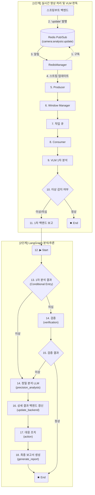

# AEGIS AI Agent

**LangGraph-based Triggered Analytics Pipeline - LangGraph 기반 조건부 분석 시스템**

**스프링부트 백엔드**가 Redis에 등록한 카메라 목록을 동적으로 관리하며, 실시간 영상 프레임을 **LangGraph 기반 파이프라인**으로 처리하여 VLM 분석, 백엔드 보고, 조건부 정밀 분석(LLM) 및 다단계 추론을 수행하는 시스템입니다.

## 🛠️ 기술 스택

| 분류 | 기술 | 비고 |
|------|------|------|
| Language | Python 3.12+ | 안정적인 멀티스레딩 환경 |
| Framework | LangGraph 1.0, LangChain Core 1.2 | 상태 기반 다단계 추론 |
| API | FastAPI, Uvicorn | 에이전트 모니터링 및 상태 조회 |
| **영상처리** | **PyAV (av)** | 패킷 레벨 제어 및 초고속 Muxing |
| **저장소** | **Boto3 (S3 / MinIO)** | 증거 영상 클립 저장 |
| 캐시 | Redis | 동적 카메라 설정 및 상태 관리 |
| HTTP | requests | 백엔드 및 AI 서버 통신 |

---

## 🎯 시스템 개요

### 핵심 개념
- **하이브리드 아키텍처**: 실시간 영상 수집(PyAV)은 고성능 스레딩 방식을 사용하고, 복잡한 분석 및 추론 로직은 **LangGraph**를 통해 모델링합니다.
- **패킷 기반 하이브리드 파이프라인**: 
    - **분석 경로**: 비디오 패킷을 디코딩하여 VLM 분석에 사용.
    - **저장 경로**: 원본 패킷을 메모리(PacketBuffer)에 30초간 저장하여 이벤트 발생 시 즉시 클립 생성.
- **키프레임 보정 및 Remuxing**: 영상 추출 시 시작점을 **I-Frame**으로 자동 보정(Back-tracking)하고, 재인코딩 없이 MP4로 변환하여 CPU 부하를 최소화하고 원본 화질을 유지합니다.
- **3단계 백엔드 보고 체계**: 
    1. **이벤트 생성 보고**: 이상 감지 시 즉시 보고 및 `event_id` 발급.
    2. **영상 클립 업데이트**: S3 업로드 완료 후 클립 경로(`clipUrl`) 전송.
    3. **정밀 분석 최종 보고**: LangGraph 분석 종료 후 상세 결과 전송.
- **Redis 동적 스트림 관리**: 에이전트 재시작 없이 **스프링부트 백엔드**가 Redis 설정을 변경하여 분석 대상 카메라를 실시간으로 제어합니다.
- **FastAPI 기반 에이전트**: 에이전트 자체가 FastAPI 서버로 실행되어, 외부에서 상태를 모니터링하고 관리할 수 있습니다.

---

## 📂 프로젝트 구조

```
src/
├── __init__.py
├── app.py                  # 메인 오케스트레이터 (AegisAgent)
├── config.py               # 설정 (Config 데이터클래스)
├── utils.py                # 유틸리티 (로깅, 시그널 핸들러)
├── api/
│   ├── __init__.py
│   ├── api_server.py       # FastAPI 서버 (에이전트 상태 조회)
│   └── mock_server.py      # Mock 서버 (VLM, Precision, Backend)
├── clients/
│   ├── __init__.py
│   ├── vlm_client.py       # VLM API 클라이언트
│   ├── precision_client.py # Precision LLM 클라이언트
│   ├── backend_client.py   # Backend API 클라이언트 (생성/클립/갱신)
│   ├── storage_client.py   # S3 / MinIO 저장소 클라이언트
│   └── vector_store_client.py # Vector Store 클라이언트
├── core/
│   ├── __init__.py
│   ├── producer.py         # 패킷 수집 및 하이브리드 처리 (PyAV)
│   ├── packet_buffer.py    # 30초 패킷 버퍼링 및 키프레임 보정
│   ├── muxer.py            # 재인코딩 없는 MP4 Muxing 유틸리티
│   ├── consumer.py         # 분석 및 클립 생성 오케스트레이션
│   ├── queue_manager.py    # 프레임 큐 관리
│   ├── windowing.py        # 윈도우 매니저
│   └── redis_manager.py    # Redis 연동 (카메라 목록 동기화)
├── graph/
│   ├── __init__.py
│   ├── analysis_graph.py   # LangGraph 워크플로우 빌드
│   ├── state.py            # 분석 상태 정의 (AnalysisState)
│   ├── nodes/              # 그래프 노드들
│   │   ├── __init__.py
│   │   ├── vlm_analysis.py
│   │   ├── backend_report.py
│   │   ├── verification.py
│   │   ├── precision_analysis.py
│   │   ├── update_backend.py
│   │   ├── action.py
│   │   └── generate_report.py
│   └── edges/              # 그래프 엣지 (라우터)
│       ├── __init__.py
│       └── routers.py
├── retrieval/              # RAG 관련 (작업 중)
│   ├── __init__.py
│   ├── indexer.py          # 문서 인덱싱
│   └── retriever_factory.py
└── tools/                  # LangChain 도구 (작업 중)
    ├── __init__.py
    └── search_tools.py     # 매뉴얼/사례 검색
```

---

## 🧩 주요 컴포넌트 역할

이 에이전트는 여러 컴포넌트가 협력하여 동작하며, 각 컴포넌트는 다음과 같은 역할을 수행합니다.

- **`Producer` (수집가)**: RTSP 스트림을 **PyAV 패킷 단위**로 수집합니다. 분석용 프레임은 디코딩하여 전달하고, 원본 패킷은 버퍼에 저장합니다.
- **`PacketBuffer` (저장소)**: 최근 30초간의 원본 패킷을 보관하며, 이상 상황 발생 시 **가장 가까운 키프레임**을 찾아 시작점을 보정합니다.
- **`Muxer` (포장공)**: 잘라낸 패킷들을 재인코딩 없이 MP4 컨테이너로 합쳐 신속하게 증거 영상을 만듭니다.
- **`Consumer` (중재자)**: VLM 분석 결과가 '이상'일 때, 백엔드 보고와 영상 업로드를 지휘하고 LangGraph를 실행합니다.
- **`StorageClient` (배달원)**: 생성된 MP4 파일을 S3의 `/clips/temp` 경로에 업로드하고 백엔드에 배송 완료(URL 업데이트) 알림을 보냅니다.
- **`RedisManager` (관제탑)**: 백엔드의 지시를 받아 어떤 카메라의 프로듀서를 가동할지 실시간으로 관리합니다.

---

## 🚀 설치 및 실행

### 설치

```bash
# 가상환경 생성
python -m venv .venv
source .venv/bin/activate  # Windows: .venv\Scripts\activate

# 의존성 설치
pip install -r requirements.txt
```

### 실행 방법

에이전트는 **모의(Mock) 서버 모드**와 **실제(Real) 서버 모드** 두 가지로 실행할 수 있으며, 각 컴포넌트별로 개별 설정도 가능합니다.

실행 시 에이전트 자체 API 서버가 **8000번 포트**에서 시작됩니다.

#### 1. 모의(Mock) 서버 모드 (기본값, 개발 및 테스트용)

외부 AI/백엔드 서버 없이 에이전트의 전체 파이프라인 동작을 테스트하기 위한 모드입니다. 별도의 옵션 없이 실행하면 기본적으로 이 모드로 동작합니다.

```sh
# 프로젝트 루트 폴더에서 실행
python -m src.app
```

#### 2. 실제(Real) 서버 모드 (통합 및 운영용)

실제 VLM, LLM, 백엔드 서버와 연동하여 시스템 전체를 운영할 때 사용합니다.

```sh
# 프로젝트 루트 폴더에서 실행
python -m src.app --no-mock
```

#### 3. 하이브리드 모드 (개별 컴포넌트 제어)

특정 컴포넌트만 실제 서버를 사용하고, 나머지는 Mock 서버를 사용하고 싶을 때 유용합니다.

*   `--real-vlm`: VLM만 실제 서버 사용 (나머지는 Mock)
*   `--real-precision`: 정밀 분석만 실제 서버 사용 (나머지는 Mock)
*   `--real-backend`: 백엔드만 실제 서버 사용 (나머지는 Mock)

**실행 예시:**

```sh
# VLM만 실제 서버 사용
python -m src.app --real-vlm

# VLM과 백엔드는 실제 서버, 정밀 분석은 Mock 사용
python -m src.app --real-vlm --real-backend
```

### Docker 실행

```dockerfile
FROM python:3.13-slim
WORKDIR /app
COPY requirements.txt .
RUN pip install -r requirements.txt
COPY src/ ./src/
CMD ["python", "-m", "src.app"]
```

---

## ⚙️ 설정 (config.py)

### 모드 설정

```python
mock_mode: bool = True  # True: Mock 서버, False: 실제 서버
```

### 실제 서버 주소

```python
_real_vlm_endpoint: str = "http://<VLM 서버>:8001/analyze"
_real_precision_endpoint: str = "http://<LLM 서버>:8002/precision_analyze"
_real_backend_create_endpoint: str = "http://<백엔드>:8080/internal/agent/events"
_real_backend_clip_endpoint: str = "http://<백엔드>:8080/internal/agent/events/{event_id}/clip"
_real_backend_update_endpoint: str = "http://<백엔드>:8080/internal/agent/events/{event_id}/analysis"
```

### RTSP 및 비디오 설정

| 설정 | 기본값 | 설명 |
|------|--------|------|
| `rtsp_host` | `127.0.0.1` | MediaMTX 호스트 |
| `rtsp_port` | `8554` | RTSP 포트 |
| `fps` | `1` | VLM 분석용 프레임 추출 속도 |
| `video_buffer_seconds` | `30` | 메모리에 유지할 패킷 시간 (초) |

### S3 저장소 설정

| 설정 | 기본값 | 설명 |
|------|--------|------|
| `s3_endpoint` | `http://localhost:9000` | S3 또는 MinIO 엔드포인트 |
| `s3_bucket` | `aegis` | 영상 클립 저장 버킷명 |
| `clip_temp_path` | `temp/clips` | 버킷 내 임시 저장 경로 |
| `s3_secure` | `False` | SSL 사용 여부 |

### 분석 파이프라인 설정

| 설정 | 기본값 | 설명 |
|------|--------|------|
| `num_workers` | `4` | 컨슈머 워커 수 |
| `window_size` | `8` | 윈도우 프레임 수 |
| `window_slide` | `4` | 슬라이드 프레임 수 |
| `flush_timeout` | `30` | 플러시 타임아웃 (초) |
| `min_flush_size` | `5` | 최소 플러시 크기 |
| `queue_max_size` | `20` | 큐 최대 크기 |

### 네트워크 설정

| 설정 | 기본값 | 설명 |
|------|--------|------|
| `vlm_timeout` | `30` | VLM 타임아웃 (초) |
| `vlm_max_retries` | `3` | VLM 재시도 횟수 |
| `precision_timeout` | `60` | Precision 타임아웃 (초) |
| `backend_timeout` | `10` | Backend 타임아웃 (초) |
| `reconnect_delay` | `2.0` | 재연결 지연 (초) |
| `max_reconnect_delay` | `60.0` | 최대 재연결 지연 (초) |

### Redis 설정

| 설정 | 기본값 | 설명 |
|------|--------|------|
| `redis_host` | `localhost` | Redis 호스트 |
| `redis_port` | `6379` | Redis 포트 |
| `redis_db` | `0` | Redis DB 번호 |
| `redis_analysis_cameras_key` | `analysis:cameras` | 카메라 목록 키 |
| `redis_update_channel` | `camera:analysis:update` | 업데이트 채널 |

---

## 📊 에이전트 상태 모니터링

에이전트가 실행되면 **http://localhost:8000** 에서 API 서버가 동작합니다.

*   **헬스 체크**: `GET /health`
    *   응답: `{"status": "healthy"}`
*   **상태 조회**: `GET /status`
    *   현재 실행 중인 프로듀서 수, 큐 크기, 처리 통계 등을 JSON으로 반환합니다.
    *   **VLM 분석 시간 확인**: 응답 JSON의 `consumer_stats` 객체 내 `avg_vlm_time` 필드에서 평균 VLM 분석 소요 시간(초)을 확인할 수 있습니다.

    **요청 예시:**
    ```bash
    curl http://localhost:8000/status
    ```

    **응답 예시:**
    ```json
    {
      "producers": 2,
      "queue_size": 0,
      "consumer_stats": {
        "num_workers": 4,
        "total_processed": 15,
        "total_failed": 0,
        "total_abnormal": 2,
        "total_normal": 13,
        "success_rate": 100.0,
        "abnormal_rate": 13.33,
        "avg_vlm_time": 1.245  // 평균 VLM 분석 시간 (초)
      },
      "window_stats": { ... }
    }
    ```

---

## 🔄 상세 워크플로우 (Workflow)

시스템의 전체 동작 흐름은 크게 **실시간 영상 처리**와 **LangGraph 분석/추론** 두 단계로 나뉩니다.

### 1. 개요 다이어그램 (Simple Workflow)
전체적인 처리 단계의 흐름을 간략하게 보여줍니다.



### 2. 상세 다이어그램 (Detailed Workflow with Data Flow)
각 단계에서 어떤 데이터가 생성되고 전달되는지를 상세하게 보여줍니다.

> **범례**: ⬜ 처리 단계(Process) | 🟦 데이터 객체(Data) | 🟧 외부 시스템(External)

```mermaid
graph TD
    %% 다크 테마 스타일 정의
    classDef proc fill:#2d2d2d,stroke:#9e9e9e,stroke-width:2px,color:#ffffff;
    classDef data fill:#1a237e,stroke:#5c6bc0,stroke-width:2px,stroke-dasharray: 5 5,color:#ffffff;
    classDef ext fill:#3e2723,stroke:#ffab91,stroke-width:2px,color:#ffffff;
    classDef router fill:#004d40,stroke:#4db6ac,stroke-width:2px,color:#ffffff;

    subgraph RealTime["[1단계] 동적 설정 및 실시간 영상 처리 (core)"]
        direction TB
        
        %% Node Definitions
        ExtMgr["1. 스프링부트 백엔드"]:::ext
        RedisCam[("Redis Storage<br>analysis:cameras")]:::ext
        RedisCh[("2. Redis Pub/Sub<br>channel: camera:analysis:update")]:::ext
        RM["3. RedisManager"]:::proc
        P["4. Producer Pool"]:::proc
        W["5. Window Manager"]:::proc
        Q["6. 작업 큐"]:::proc
        C["7. Consumer"]:::proc
        N1["8. vlm_analysis<br>(VLM 1차 분석)"]:::proc
        Router0{"9. 이상 감지?"}:::router
        N2["10. backend_report<br>(1차 백엔드 보고)"]:::proc
        Backend["11. 스프링부트 백엔드"]:::ext
        EndLocal(⏹️ End):::proc

        %% Data Definitions
        D_Frames[("Raw Frames<br>[JPEG Bytes...]")]:::data
        D_Window[("Window Data<br>• Frames (List)<br>• Camera Info<br>• Time")]:::data
        D_Risk[("• Risk Level<br>• Event Type")]:::data
        D_Req1[("Request<br>• camera_id<br>• risk<br>• type<br>• occurred_at")]:::data
        D_Res1[("Response<br>• eventId")]:::data

        %% Connections
        ExtMgr -. "카메라 정보 SET" .-> RedisCam
        RM -. "구독" .-> RedisCh
        ExtMgr -- "'update' 발행" --> RedisCh
        RedisCh -- "알림" --> RM
        RM -. "카메라 목록 조회" .-> RedisCam
        RM -- "스트림 업데이트" --> P
        P --> D_Frames
        D_Frames --> W
        W --> D_Window
        D_Window --> Q
        Q --> C
        C --> N1
        N1 --> D_Risk
        D_Risk --> Router0
        Router0 -- "정상" --> EndLocal
        Router0 -- "의심 / 이상" --> N2
        N2 -.-> D_Req1
        D_Req1 -.-> Backend
        Backend -.-> D_Res1
    end

    subgraph LangGraph["[2단계] LangGraph 분석 및 다단계 추론 (graph)"]
        direction TB
        
        %% Node Definitions
        Router{"13. analysis_router<br>(Conditional Entry)"}:::router
        N_Verify["14. verification<br>(검증 노드)"]:::proc
        N_Precise["14. precision_analysis<br>(정밀 분석 LLM)"]:::proc
        Router2{"15. verification_router"}:::router
        N_Update["16. update_backend<br>(상세 결과 갱신)"]:::proc
        Backend2["17. 스프링부트 백엔드"]:::ext
        N_Action["18. action<br>(대응 조치)"]:::proc
        N7["19. generate_report<br>(최종 보고서 생성)"]:::proc
        EndFinal(⏹️ End):::proc

        %% Data Definitions
        D_Input[("12. LangGraph Input (invoke)<br>• camera_info, frames<br>• vlm_result, event_id<br>• occurred_at")]:::data
        D_Detail[("상세 분석 결과<br>• summary<br>• risk_score")]:::data
        D_Req2[("Request<br>• risk<br>• type<br>• summary<br>• risk_score")]:::data
        D_Actions[("대응 결과")]:::data

        %% Connections
        D_Input --> Router
        Router -- "의심" --> N_Verify
        Router -- "이상" --> N_Precise
        N_Verify --> Router2
        Router2 -- "정상" --> EndFinal
        Router2 -- "이상" --> N_Precise
        N_Precise --> D_Detail
        D_Detail --> N_Update
        N_Update -.-> D_Req2
        D_Req2 -.-> Backend2
        N_Update --> N_Action
        N_Action --> D_Actions
        D_Actions --> N7
        N7 --> EndFinal
    end

    %% Connection between subgraphs
    D_Res1 ==> D_Input
```



### [1단계] 동적 설정 및 실시간 영상 처리 (`core` 패키지)
고성능 처리를 위해 일반적인 Python 멀티스레딩 방식으로 동작하며, `core` 패키지의 모듈들이 담당합니다.

1.  **RedisManager (동적 설정 관리)**: 백엔드로부터 Redis Pub/Sub을 통해 카메라 변경 알림을 수신하고, Redis Storage에서 최신 카메라 목록을 조회하여 `Producer` 풀을 동적으로 생성하거나 제거합니다.
2.  **Producer (영상 수집)**: 할당된 RTSP 카메라 스트림에 연결하여 실시간으로 프레임을 캡처합니다.
3.  **Window Manager (데이터 윈도우 구성)**: 수집된 프레임을 설정된 시간 단위(예: 8초)의 윈도우로 그룹화하여 분석 가능한 데이터 단위로 만듭니다.
4.  **Queue Manager (작업 대기열)**: 생성된 윈도우 데이터를 큐에 적재하여 `Consumer`가 처리할 수 있도록 버퍼링합니다.
5.  **Consumer (1차 분석 및 라우팅)**: 큐에서 데이터를 가져와 VLM(Vision Language Model)을 사용해 1차 분석을 수행합니다.
6.  **Router (분기 처리)**: 1차 분석 결과가 '정상'이면 프로세스를 종료하고, '이상' 또는 '의심'인 경우 백엔드에 1차 보고를 수행한 후 2단계 LangGraph 파이프라인을 호출합니다.
7.  **Backend Report (1차 보고)**: 이상 징후가 감지되면 즉시 백엔드에 알림을 보내고 `event_id`를 발급받습니다. 이는 2단계 분석의 추적 ID로 사용됩니다.

### [2단계] LangGraph 분석 및 다단계 추론 (`graph` 패키지)
`Consumer`가 1차 보고 후 생성한 `event_id`와 함께 LangGraph 파이프라인을 실행합니다.

10. **조건부 진입 (Entry Point: `analysis_router`)**:
    *   그래프의 시작점이 특정 노드가 아닌, 상태(`risk_level`)에 따른 **조건부 진입**으로 변경되었습니다.
    *   `AnalysisState`의 `risk_level`을 확인하여 바로 다음 노드로 점프합니다.
        *   **'NORMAL'**: 종료.
        *   **'SUSPICIOUS'**: '검증' 노드로 진입.
        *   **'ABNORMAL'**: '정밀 분석' 노드로 진입.
11. **검증 (노드: `verification`)** (SUSPICIOUS 경로):
    *   **[작업 예정]** '의심' 상황에 대한 구체적인 검증 로직은 추후 확정될 예정입니다.
    *   현재는 임시로 정밀 분석으로 넘기거나 종료하는 형태로 동작합니다.
12. **검증 후 분기 (엣지: `verification_router`)**:
    *   검증 결과가 **'ABNORMAL'**인 경우에만 '정밀 분석 (LLM)' 노드로 진행합니다.
    *   'NORMAL'인 경우 분석을 종료합니다.
13. **정밀 분석 (LLM) (노드: `precision_analysis`)**:
    *   `precision_client`를 사용하여 정밀 분석 서버에 프레임 묶음과 `event_id`를 전송합니다.
    *   LLM을 통해 구체적인 **`event_type`**, **`summary`**, **`risk_score`** 등을 한 번에 분석하여 `AnalysisState`에 저장합니다.
14. **상세 결과 백엔드 갱신 (노드: `update_backend`)**:
    *   `backend_client`를 사용하여 `event_id`와 함께 상세 분석 결과(`risk`, `type`, `summary`, `risk_score`)를 **스프링부트 백엔드**로 전송합니다.
    *   백엔드는 이 정보로 기존 이벤트를 **덮어쓰기(갱신)**합니다.
15. **대응 조치 (노드: `action`)**:
    *   **[작업 예정]** 정밀 분석 결과를 바탕으로 필요한 대응 조치(예: 매뉴얼 검색, 알림 발송 등)를 결정하고 수행합니다.
    *   수행된 조치 내역을 `AnalysisState`의 `actions` 필드에 저장합니다.
16. **최종 보고서 생성 (노드: `generate_report`)**:
    *   **[작업 예정]** **RAG(검색 증강 생성)** 기능을 수행하는 노드입니다.
    *   분석 결과와 `retrieval` 도구(대응 매뉴얼, 과거 사례)를 사용하여 최종 상세 보고서를 작성하고, `AnalysisState`의 `report` 필드를 업데이트합니다.
17. **워크플로우 종료 (END)**: 모든 분석이 완료된 최종 `AnalysisState`를 반환하며 그래프 실행이 종료됩니다.

---

## 🤖 LangGraph 파이프라인 상태

### `src/graph/state.py`: AnalysisState 정의

그래프의 모든 노드(단계)가 공유하고 업데이트하는 중앙 데이터 구조입니다. `TypedDict`를 사용하여 각 데이터의 타입을 명확하게 정의합니다.

```python
from typing import TypedDict, List, Optional, Literal, Dict, Any
from datetime import datetime

# 1차 분류: VLM 분석 결과
RiskLevel = Literal["NORMAL", "SUSPICIOUS", "ABNORMAL"]

# 2차 분류: 정밀 분석 이벤트 유형
EventType = Literal["ASSAULT", "BURGLARY", "DUMP", "SWOON", "VANDALISM", "UNKNOWN"]

class AnalysisState(TypedDict):
    """LangGraph 분석 파이프라인의 상태를 정의하는 TypedDict"""

    # --- 초기 입력 ---
    camera_id: str
    camera_name: str
    camera_location: str
    occurred_at: datetime  # 분석 윈도우의 시작 시점
    frames: List[bytes]
    event_id: str
    vlm_result: Dict[str, Any]         # 1차 VLM 분석 원본 결과
    window_start: Union[int, str] # 윈도우 시작 시간 추가
    window_end: Union[int, str]   # 윈도우 종료 시간 추가
    
    # --- 워크플로우 진행 중 생성 ---
    precision_result: Dict[str, Any]   # 2차 정밀 분석 원본 결과
    
    # --- 최종 분석 결과 (워크플로우를 거치며 갱신됨) ---
    risk_level: RiskLevel
    event_type: EventType
    summary: str
    risk_score: float
    report: str             # -- 작업중 -- (보고서 생성 LLM 결과)
    
    # --- 메타 데이터 ---
    actions: list           # -- 작업중 --
    rag_references: list    # -- 작업중 --
    errors: List[str]
```

---

## 📁 디렉토리 구조 (LangGraph 적용 후)

```
aegis-ai-agent/src/
│
├── __init__.py
├── app.py               # 🚀 에이전트 실행의 주 진입점
├── config.py            # ⚙️ 전역 설정
├── utils.py             # 🛠️ 공용 유틸리티 함수
│
├── core/                  # 🧠 에이전트 핵심 파이프라인 (실시간 처리)
│   ├── __init__.py
│   ├── consumer.py        # - 작업 오케스트레이션 (LangGraph 트리거)
│   ├── producer.py        # - 비디오 스트림 프레임 캡처
│   ├── windowing.py       # - 프레임 윈도우 관리
│   ├── queue_manager.py   # - 작업 큐 관리
│   └── redis_manager.py   # - Redis 연동 및 동적 카메라 관리
│
├── clients/               # 📡 외부 서비스 통신 클라이언트
│   ├── __init__.py
│   ├── backend_client.py  # - Aegis 백엔드 API 클라이언트
│   ├── precision_client.py# - 정밀 분석 API 클라이언트
│   ├── vlm_client.py      # - VLM API 클라이언트
│   └── vector_store_client.py # - Vector DB 클라이언트 (RAG용)
│
├── graph/                 # 🤖 LangGraph 기반 다단계 분석/추론 계층
│   ├── __init__.py
│   ├── analysis_graph.py  # - 메인 분석 워크플로우(그래프) 빌더
│   ├── state.py           # - 그래프의 상태(AnalysisState) 객체 정의
│   │
│   ├── nodes/             # 📄 그래프의 각 '단계' (기능별 파일 분리)
│   │   ├── __init__.py
│   │   ├── vlm_analysis.py       # 1. VLM 1차 분석
│   │   ├── backend_report.py     # 2. 1차 백엔드 보고
│   │   ├── verification.py       # 3. 추가 검증
│   │   ├── precision_analysis.py # 4. 정밀 분석 (LLM)
│   │   ├── update_backend.py     # 5. 백엔드 상세 갱신
│   │   ├── action.py             # 6. 대응 조치 (추가됨)
│   │   └── generate_report.py    # 7. RAG 기반 최종 보고서 생성
│   │
│   └── edges/             # ↪️ 그래프의 '흐름 제어'
│       ├── __init__.py
│       └── routers.py     # - 조건부 분기 로직 (analysis_router, verification_router)
│
├── retrieval/             # 📚 RAG 및 검색 관련 기능
│   ├── __init__.py
│   ├── retriever_factory.py # - Retriever 객체 생성 (Vector DB와 연결)
│   ├── indexer.py           # - 외부 문서(매뉴얼 등)를 임베딩하고 DB에 저장
│   │
│   └── tools/               # 🛠️ LangGraph 노드에서 사용할 도구
│       ├── __init__.py
│       ├── search_manual_tool.py     # - '대응 매뉴얼 검색' 도구
│       └── search_past_cases_tool.py # - '유사 과거 사례 검색' 도구
│
└── api/                   # 🌐 에이전트 자체 API 서버 (상태 조회 등)
    ├── __init__.py
    ├── api_server.py      # - 에이전트 상태 조회를 위한 API 서버
    └── mock_server.py     # - 외부 서비스 Mock 서버
```