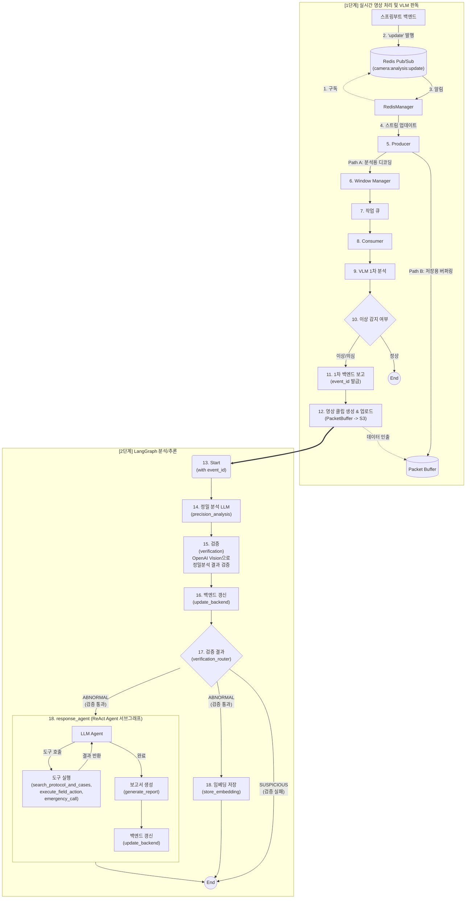

# AEGIS AI Agent

> LangGraph 기반 실시간 영상 분석 파이프라인

## 개요

AEGIS AI Agent는 RTSP 스트림을 실시간으로 수신하여 VLM(Vision Language Model) 분석을 수행하고, 이상 감지 시 LangGraph 기반 다단계 추론 파이프라인을 통해 정밀 분석, 백엔드 보고, 영상 클립 생성을 자동화하는 시스템입니다.

## 기술 스택

| 분류 | 기술 | 버전 | 용도 |
|------|------|------|------|
| Language | Python | 3.12+ | 메인 언어 |
| Framework | LangGraph | 1.0.7 | 상태 기반 워크플로우 |
| Framework | LangChain Core | 1.2.7 | LLM 추상화 |
| API | FastAPI | 0.128.0 | REST API 서버 |
| API | Uvicorn | 0.40.0 | ASGI 서버 |
| 영상처리 | PyAV | 16.1.0 | RTSP 패킷 수신 및 Muxing |
| 영상처리 | OpenCV | 4.13.0 | 프레임 리사이징/인코딩 |
| 캐시 | Redis | 7.1.0 | 카메라 목록 동기화, Pub/Sub |
| HTTP | Requests | 2.32.5 | 백엔드/VLM/LLM 통신 |
| 유효성검사 | Pydantic | 2.12.5 | 데이터 모델 검증 |

## 프로젝트 구조

```
src/
├── __init__.py
├── app.py                      # 메인 진입점 (FastAPI 앱 + AegisAgent 오케스트레이터)
├── config.py                   # Config 데이터클래스 (전체 설정 관리)
├── utils.py                    # 유틸리티 (로깅, 시그널 핸들러, 지수 백오프)
│
├── api/
│   ├── __init__.py
│   └── mock_server.py          # Mock 서버 (VLM, Precision, Backend)
│
├── clients/
│   ├── __init__.py
│   ├── backend_client.py       # 백엔드 API 클라이언트 (이벤트 CRUD, 클립/보고서 업로드)
│   ├── precision_client.py     # 정밀 분석 LLM 클라이언트
│   ├── vlm_client.py           # VLM 분석 클라이언트
│   ├── vector_store_client.py  # Qdrant Vector DB 클라이언트
│   └── openai_client.py        # OpenAI API 클라이언트 (Vision, Embedding)
│
├── core/
│   ├── __init__.py
│   ├── producer.py             # RTSP 패킷 수신 스레드 (PyAV 기반)
│   ├── packet_buffer.py        # 30초 원형 패킷 버퍼 (키프레임 백트래킹)
│   ├── muxer.py                # MP4 Muxing (faststart, edts 제거, 해상도 패치)
│   ├── consumer.py             # 분석 워커 풀 (VLM → 클립 생성 → LangGraph)
│   ├── queue_manager.py        # 오버플로우 보호 작업 큐
│   ├── windowing.py            # 프레임 슬라이딩 윈도우 생성기
│   └── redis_manager.py        # Redis Pub/Sub 기반 카메라 동기화
│
├── graph/
│   ├── __init__.py
│   ├── analysis_graph.py       # LangGraph 워크플로우 빌더
│   ├── state.py                # AnalysisState TypedDict 정의
│   ├── nodes/
│   │   ├── __init__.py
│   │   ├── verification.py     # 정밀 분석 결과 검증
│   │   ├── precision_analysis.py # 정밀 분석 LLM 호출
│   │   ├── update_backend.py   # 백엔드 이벤트 갱신
│   │   └── store_embedding.py  # 이벤트 임베딩 저장 (response_agent와 병렬)
│   ├── subgraphs/
│   │   ├── __init__.py
│   │   └── response_agent.py   # ReAct Agent (대응 조치 + 보고서 생성 + 업로드)
│   └── edges/
│       ├── __init__.py
│       └── routers.py          # 조건부 분기 (analysis_router, verification_router)
│
├── services/                   # 비즈니스 로직 서비스
│   ├── __init__.py
│   └── report_generator.py     # 보고서 생성 서비스 (HTML, PDF, DOCX, PPTX)
│
└── tools/                      # 분석 도구
    ├── __init__.py
    ├── embedding_tools.py      # 임베딩 도구 (텍스트→벡터 변환)
    └── search_tools.py         # 매뉴얼/사례 검색 (VectorStoreClient 사용)

templates/
└── reports/                    # 보고서 템플릿
    ├── README.md               # 템플릿 사용법
    ├── report_template.docx    # Word 템플릿
    ├── report_template.pptx    # PowerPoint 템플릿
    └── report_template.html    # PDF용 HTML 템플릿

scripts/
└── test_report_templates.py    # 보고서 템플릿 테스트 스크립트
```

---

## 핵심 컴포넌트 상세

### app.py - AegisAgent

메인 오케스트레이터 클래스입니다. FastAPI 앱의 lifespan 컨텍스트에서 초기화됩니다.

**주요 속성:**
- `queue_manager`: 분석 작업 큐
- `window_manager`: 프레임 윈도우 관리
- `consumer_pool`: 분석 워커 풀
- `redis_manager`: 카메라 동기화
- `producers`: 카메라별 프로듀서 딕셔너리
- `packet_buffers`: 카메라별 패킷 버퍼
- `source_streams`: 카메라별 스트림 메타데이터

**FastAPI 엔드포인트:**

| Method | Path | 설명 |
|--------|------|------|
| GET | `/health` | 헬스 체크 |
| GET | `/status` | 에이전트 상태 조회 |

---

### config.py - Config

모든 설정을 관리하는 데이터클래스입니다.

**모드 설정:**

| 설정 | 기본값 | 설명 |
|------|--------|------|
| `mock_mode` | `True` | Mock 서버 사용 여부 |
| `real_vlm` | `False` | 실제 VLM 서버 사용 |
| `real_precision` | `False` | 실제 정밀 분석 서버 사용 |
| `real_backend` | `False` | 실제 백엔드 서버 사용 |
| `real_s3` | `False` | 실제 S3 서버 사용 |

**RTSP/프레임 설정:**

| 설정 | 기본값 | 설명 |
|------|--------|------|
| `rtsp_host` | `127.0.0.1` | RTSP 서버 호스트 |
| `rtsp_port` | `8554` | RTSP 서버 포트 |
| `frame_width` | `640` | 분석용 이미지 너비 |
| `frame_height` | `360` | 분석용 이미지 높이 |
| `jpeg_quality` | `60` | JPEG 품질 |
| `fps` | `1` | 분석 FPS |
| `video_buffer_seconds` | `30` | 패킷 버퍼 시간 |

**분석 파이프라인 설정:**

| 설정 | 기본값 | 설명 |
|------|--------|------|
| `num_workers` | `4` | 워커 스레드 수 |
| `window_size` | `8` | 윈도우 프레임 수 |
| `window_slide` | `4` | 윈도우 슬라이드 간격 |
| `flush_timeout` | `30` | 타임아웃 강제 처리 |
| `min_flush_size` | `5` | 강제 처리 최소 프레임 |
| `queue_max_size` | `20` | 큐 최대 크기 |

**네트워크 설정:**

| 설정 | 기본값 | 설명 |
|------|--------|------|
| `vlm_timeout` | `30` | VLM 타임아웃 |
| `precision_timeout` | `60` | 정밀 분석 타임아웃 |
| `backend_timeout` | `10` | 백엔드 타임아웃 |
| `redis_host` | `localhost` | Redis 호스트 |
| `redis_port` | `6379` | Redis 포트 |

---

### core/producer.py - FrameProducer

RTSP 스트림을 수신하는 스레드입니다.

**처리 경로:**
- **Path A (분석)**: 패킷 디코딩 → BGR 이미지 → 리사이즈 → JPEG → WindowManager
- **Path B (저장)**: 원본 패킷을 PacketBuffer에 저장 (디코딩 없음)

**주요 메서드:**
- `_open_stream()`: PyAV로 RTSP 스트림 열기 (TCP 강제, 5초 타임아웃)
- `_preprocess_frame()`: 리사이즈 + JPEG 인코딩
- `run()`: 메인 루프 - 패킷 수신 → 버퍼 저장 → 디코딩 → 분석

---

### core/packet_buffer.py - PacketBuffer

최근 30초 패킷을 저장하는 원형 버퍼입니다.

**주요 메서드:**
- `add_packet()`: 패킷 추가, 오래된 패킷 자동 제거
- `get_full_buffer()`: 키프레임 백트래킹 후 패킷 리스트 반환

**키프레임 백트래킹:**
1. 시작 시점 계산 (현재 - clip_duration)
2. 시작점 이전의 가장 가까운 키프레임 탐색
3. 키프레임부터 끝까지 패킷 리스트 반환

---

### core/muxer.py - MP4 Muxing

패킷을 브라우저 재생 가능한 MP4로 변환합니다.

**mux_packets_to_mp4() 처리 과정:**
1. PyAV로 MP4 컨테이너 생성
2. DTS/PTS 정규화 (0부터 시작, 단조 증가)
3. ftyp 앞 쓰레기 제거
4. faststart 적용 (moov를 mdat 앞으로)
5. edts 박스 제거 (재생 위치 문제 방지)
6. avc1/tkhd 해상도 패치 (PyAV 버그 대응)

**내부 함수:**
- `_find_atom()`: MP4 atom 위치 탐색
- `_patch_stco()`: moov 이동 후 stco/co64 오프셋 재계산
- `_remove_edts()`: edts 박스 제거
- `_patch_resolution()`: avc1/tkhd에 해상도 강제 설정
- `_faststart()`: moov를 mdat 앞으로 이동

---

### core/consumer.py - ConsumerPool

분석 작업을 처리하는 워커 풀입니다.

**워커 처리 흐름:**
1. 큐에서 작업 인출
2. VLM 1차 분석 수행
3. NORMAL이면 종료
4. ABNORMAL/SUSPICIOUS면:
   - 백엔드에 이벤트 생성 (event_id 획득)
   - PacketBuffer에서 패킷 추출
   - mux_packets_to_mp4()로 클립 생성
   - presigned URL로 S3 업로드
   - 클립 업로드 확인
   - LangGraph 파이프라인 실행

**통계:**
- `total_processed`: 처리 완료
- `total_failed`: 실패
- `total_abnormal`: 이상 감지
- `total_normal`: 정상
- `total_vlm_time`: VLM 분석 시간 합계

---

### core/windowing.py - WindowManager

프레임을 슬라이딩 윈도우로 그룹화합니다.

**주요 로직:**
- `add_frame()`: 프레임 추가
- `_window_loop()`: 백그라운드 스레드
  - window_slide 간격마다 윈도우 생성
  - flush_timeout 경과 시 강제 처리

---

### core/queue_manager.py - QueueManager

오버플로우 보호가 있는 작업 큐입니다.

- `put()`: 큐가 가득 차면 가장 오래된 작업 삭제 후 추가
- `get()`: 타임아웃 대기 후 작업 반환

---

### core/redis_manager.py - RedisManager

Redis 기반 카메라 동기화를 담당합니다.

- `get_analysis_cameras()`: analysis:cameras 키에서 카메라 목록 조회
- `_pubsub_loop()`: camera:analysis:update 채널 구독

---

### services/report_generator.py - ReportGeneratorService

보고서를 생성하는 서비스입니다.

**generate() 메서드:**
- 입력: `report_data` (Dict), `frames` (List[bytes]), `formats` (List[str])
- 출력: `{"html": bytes, "pdf": bytes, "docx": bytes, "pptx": bytes}`

**지원 형식:**

| 형식 | 템플릿 | 설명 |
|------|--------|------|
| HTML | `report_template.html` | PDF 변환용 |
| PDF | - | wkhtmltopdf로 HTML 변환 |
| DOCX | `report_template.docx` | 공식 문서용 (Frame 1~8 이미지 삽입) |
| PPTX | `report_template.pptx` | 브리핑용 (4x2 이미지 그리드) |

**플레이스홀더:**
- `{{occurred_at}}`, `{{event_type}}`, `{{camera_name}}`, `{{camera_location}}`
- `{{risk_level}}`, `{{risk_score}}`, `{{summary}}`, `{{actions}}`
- `{{frames}}` 또는 `Frame 1` ~ `Frame 8` (DOCX 표 셀용)

---

### clients/backend_client.py - BackendClient

백엔드 API 통신을 담당합니다.

| 메서드 | 엔드포인트 | 설명 |
|--------|-----------|------|
| `send_vlm_result()` | POST /internal/agent/events | 이벤트 생성, event_id 반환 |
| `update_event()` | PATCH /internal/agent/events/{id}/analysis | 정밀 분석 결과로 갱신 |
| `get_clip_upload_url()` | GET /internal/agent/events/{id}/clip/upload-url | presigned URL 획득 |
| `upload_clip()` | PUT {presigned_url} | MP4 직접 업로드 |
| `confirm_event_clip()` | POST /internal/agent/events/{id}/clip/confirm | 업로드 완료 확인 |

---

### clients/vlm_client.py - VLMClient

VLM 서버와 통신합니다.

**analyze_frames() 요청:**
- camera_id, frames (base64), timestamp, window_start/end

**응답:**
- risk_level: NORMAL / SUSPICIOUS / ABNORMAL
- event_type: ASSAULT / BURGLARY / DUMP / SWOON / VANDALISM

---

### clients/precision_client.py - PrecisionClient

정밀 분석 LLM 서버와 통신합니다.

**send_for_analysis() 요청:**
- camera_id, frames, vlm_result, occurred_at

**응답:**
- risk, event_type, summary, risk_score

---

### graph/state.py - AnalysisState

LangGraph 파이프라인의 상태 정의입니다.

| 필드 | 타입 | 설명 |
|------|------|------|
| camera_id | str | 카메라 ID |
| camera_name | str | 카메라 이름 |
| camera_location | str | 카메라 위치 |
| occurred_at | datetime | 이벤트 발생 시각 |
| frames | List[bytes] | 프레임 데이터 |
| event_id | str | 백엔드 이벤트 ID |
| vlm_result | Dict | VLM 분석 결과 |
| precision_result | Dict | 정밀 분석 결과 |
| risk_level | RiskLevel | NORMAL/SUSPICIOUS/ABNORMAL |
| event_type | EventType | 이벤트 유형 |
| summary | str | 요약 |
| risk_score | float | 위험도 점수 |
| report | str | 최종 보고서 |
| actions | list | 대응 조치 |
| rag_references | list | RAG 참조 문서 |
| embedding_stored | bool | 임베딩 저장 여부 |
| report_updated | bool | 보고서 백엔드 갱신 여부 |
| errors | List[str] | 오류 목록 |

---

### graph/analysis_graph.py - build_graph()

LangGraph 워크플로우를 빌드합니다.

```
[Entry Point] → precision_analysis → verification → update_backend → verification_router
    ├─ ABNORMAL → response_agent → store_embedding → END
    └─ SUSPICIOUS → END
```

---

### 임베딩 및 RAG 검색 흐름

#### 개요

| 구분 | 동작 | 임베딩 시점 | 저장 여부 |
|-----|------|-----------|----------|
| **과거 사례** | `store_embedding` 노드에서 저장 | 사건 처리 완료 시 | ✅ Qdrant에 저장 |
| **현재 사건 (검색용)** | `search_protocol_and_cases` 도구에서 검색 | 검색 시 실시간 | ❌ 저장 안 함 |

#### 저장 흐름 (store_embedding)

현재 사건을 **미래 검색을 위해** Qdrant에 저장합니다.

```
[현재 사건 처리 완료]
    ↓
store_embedding 노드
    ↓
임베딩 대상 텍스트 구성:
    "카메라: {camera_name} ({camera_location})
     발생시각: {occurred_at}
     이벤트유형: {event_type}
     상황: {summary}"
    ↓
OpenAI Embedding API 호출 → 벡터 변환
    ↓
Qdrant (past_cases 컬렉션) 저장
```

**저장 데이터 (Payload):**

| 필드 | 설명 |
|-----|------|
| `event_id` | 백엔드 이벤트 ID |
| `camera_uuid` | 카메라 UUID |
| `camera_name` | 카메라 이름 |
| `camera_location` | 카메라 위치 |
| `event_type` | 이벤트 유형 |
| `risk_level` | 위험도 |
| `risk_score` | 위험 점수 |
| `summary` | 상황 요약 |
| `occurred_at` | 발생 시각 |
| `text_embedded` | 임베딩된 원본 텍스트 |

#### 검색 흐름 (search_protocol_and_cases)

현재 사건과 유사한 **과거 사례**를 검색합니다.

```
[response_agent에서 도구 호출]
    ↓
search_protocol_and_cases(query=summary, event_type=event_type)
    ↓
query를 실시간 임베딩 (OpenAI Embedding API)
    ↓
Qdrant (past_cases 컬렉션) 유사도 검색
    ↓
유사한 과거 사례 반환 + 대응 매뉴얼 템플릿
```

#### 흐름 다이어그램

```
[과거 사건 A] → store_embedding → Qdrant 저장 ──┐
[과거 사건 B] → store_embedding → Qdrant 저장 ──┼─→ past_cases 컬렉션
[과거 사건 C] → store_embedding → Qdrant 저장 ──┘
                                                    ↑
[현재 사건 D]                                       │
    ├─ response_agent ─→ search_protocol_and_cases ─┘ (실시간 임베딩 → 유사도 검색)
    └─ store_embedding ─→ Qdrant 저장 (미래 검색용)
```

**핵심 포인트:**
- 현재 사건은 **검색 시 실시간 임베딩**되어 과거 사례와 비교됨
- 현재 사건은 **처리 완료 후 저장**되어 미래 검색에 활용됨
- 두 작업은 **독립적**이라 병렬 실행해도 문제없음

---

### api/mock_server.py

개발/테스트용 Mock 서버입니다.

**MockVLMServer (포트 8001):**
- POST /analyze
- 25% ABNORMAL, 25% SUSPICIOUS, 50% NORMAL
- 랜덤 event_type 반환

**MockPrecisionServer (포트 8002):**
- POST /precision_analyze
- risk_score: 0.8~1.0 (이상), 0.0~0.2 (정상)

**MockBackendServer (포트 8088):**
- POST /api/vlm-results → event_id 생성
- PATCH /api/vlm-results/{event_id} → 이벤트 갱신 (report, actions 포함)
- POST /api/vlm-results/{event_id}/report → 보고서 업로드 URL 반환
- PUT /api/vlm-results/{event_id}/report/upload → 보고서 로컬 저장

**Mock 보고서 저장 위치:**
```
mock_reports/
└── {event_id}/
    ├── report.pdf
    ├── report.docx
    └── report.pptx
```

---

## 실행 방법

### 설치

```bash
python -m venv .venv
source .venv/bin/activate  # Windows: .venv\Scripts\activate
pip install -r requirements.txt
```

### 환경 변수 설정 (.env 파일)

```bash
# OpenAI API 키 (정밀 분석, 검증, 임베딩에 사용)
OPENAI_API_KEY=sk-your-openai-api-key
```

---

### CLI 옵션

| 옵션 | 설명 | 기본값 |
|------|------|--------|
| `--no-mock` | 모든 컴포넌트를 실제 서버로 전환 | False |
| `--real-vlm` | VLM만 실제 서버 사용 | False |
| `--real-precision` | 정밀 분석만 OpenAI API 사용 | False |
| `--real-backend` | 백엔드만 실제 서버 사용 | False |
| `--workers N` | 컨슈머 워커 스레드 수 | 4 |
| `--log-level LEVEL` | 로그 레벨 (DEBUG/INFO/WARNING/ERROR) | INFO |

---

### 실행 명령어 예시

#### 1. 전체 Mock 모드 (로컬 테스트)
```bash
python -m src.app
```
- VLM: Mock 서버 (localhost:8001)
- 정밀 분석: Mock 서버 (localhost:8002)
- 백엔드: Mock 서버 (localhost:8088)
- 보고서: `mock_reports/{event_id}/` 로컬 저장

---

#### 2. OpenAI API만 실제 사용 (정밀 분석 + 검증)
```bash
python -m src.app --real-precision
```
- VLM: Mock 서버
- **정밀 분석: OpenAI GPT-4.1-mini** (`config.openai_chat_model`)
- **검증(Verification): OpenAI Vision API**
- 백엔드: Mock 서버

**사용되는 설정 (config.py):**
```python
openai_api_key: str = os.getenv("OPENAI_API_KEY", "")
openai_chat_model: str = "gpt-4.1-mini"
```

---

#### 3. 실제 VLM 서버 사용
```bash
python -m src.app --real-vlm
```
- **VLM: 실제 서버** (`config._real_vlm_endpoint`)
- 정밀 분석: Mock 서버
- 백엔드: Mock 서버

**config.py에서 설정:**
```python
_real_vlm_endpoint: str = "https://your-vlm-server/v1"
_real_vlm_api_key: str = "your-vlm-api-key"
_real_vlm_model_id: str = "your-model-id"
```

---

#### 4. 실제 백엔드 서버 사용
```bash
python -m src.app --real-backend
```
- VLM: Mock 서버
- 정밀 분석: Mock 서버
- **백엔드: 실제 Spring Boot 서버**

**config.py에서 설정:**
```python
_real_backend_create_endpoint: str = "http://localhost:8080/internal/agent/events"
_real_backend_update_endpoint: str = "http://localhost:8080/internal/agent/events/{event_id}/analysis"
_real_backend_clip_endpoint: str = "http://localhost:8080/internal/agent/events/{event_id}/clip"
_real_backend_report_endpoint: str = "http://localhost:8080/internal/agent/events/{event_id}/report"
```

---

#### 5. 하이브리드 모드 (조합)
```bash
# VLM 실제 + 정밀분석 OpenAI + 백엔드 Mock
python -m src.app --real-vlm --real-precision

# VLM Mock + 정밀분석 OpenAI + 백엔드 실제
python -m src.app --real-precision --real-backend

# 모든 컴포넌트 실제 서버
python -m src.app --no-mock
```

---

#### 6. 디버그 모드
```bash
python -m src.app --log-level DEBUG --workers 2
```

---

### 백엔드 API 엔드포인트

#### 1차 분석 후 이벤트 생성 (CREATE)
```
POST /internal/agent/events
```
```json
{
  "cameraId": "uuid",
  "risk": "ABNORMAL",
  "type": "ASSAULT",
  "occurredAt": "2026-02-09T14:30:00"
}
```
**응답:** `{"event_id": "uuid"}`

---

#### 2차 분석 후 이벤트 갱신 (UPDATE)
```
PATCH /internal/agent/events/{event_id}/analysis
```
```json
{
  "risk": "ABNORMAL",
  "type": "ASSAULT",
  "summary": "검은 후드티를 입은 중년 남성이...",
  "riskScore": "0.85",
  "report": {
    "content": "# 보고서 마크다운...",
    "files": {
      "pdf": "reports/{event_id}/report.pdf",
      "docx": "reports/{event_id}/report.docx",
      "pptx": "reports/{event_id}/report.pptx"
    },
    "generated_at": "2026-02-09T14:35:00"
  },
  "actions": [
    {"type": "emergency_call", "description": "112 긴급 신고 완료"},
    {"type": "field_action", "description": "보안팀 현장 출동 지시"}
  ]
}
```

---

### Mock 서버 단독 실행

보고서 형식 테스트를 위해 Mock 백엔드 서버만 실행할 수 있습니다:

```bash
cd aegis-ai-agent/src
python -m api.mock_server
```

**또는 특정 서버만 실행:**

```bash
# Mock 백엔드 서버만 (포트 8088)
python -c "from api.mock_server import MockBackendServer; MockBackendServer().run()"

# Mock VLM 서버만 (포트 8001)
python -c "from api.mock_server import MockVLMServer; MockVLMServer().run()"

# Mock 정밀분석 서버만 (포트 8002)
python -c "from api.mock_server import MockPrecisionServer; MockPrecisionServer().run()"
```

### 보고서 템플릿 테스트

```bash
cd aegis-ai-agent
python scripts/test_report_templates.py
```
결과: `mock_reports/test_output/` 폴더에 PDF, DOCX, PPTX 생성

---

## 워크플로우

### 개요 다이어그램



### 15. 검증(verification) 노드 상세

**역할**: 정밀 분석 결과가 실제 이미지와 일치하는지 OpenAI Vision API로 검증

---

#### 검증에 사용되는 정보

| 정보 | 출처 | 용도 |
|------|------|------|
| 8개 이미지 | frames | 실제 상황 확인 |
| 카메라 이름/위치 | camera_name, camera_location | 장소 맥락 파악 |
| 발생 시각 | occurred_at | 시간 맥락 파악 |
| 1차 VLM 결과 | vlm_result | 정밀 분석과 비교 |
| 2차 정밀 분석 결과 | precision_result | 검증 대상 |

---

#### 판정 기준

1. **이미지 확인**: 8개 이미지에서 이상 상황이 실제로 보이는지 확인
2. **장소 맥락**: 카메라 위치를 고려하여 해당 장소에서 발생 가능한 상황인지 판단
3. **VLM vs 정밀분석 비교**: 1차 VLM과 2차 정밀분석 결과가 다르면 이미지를 보고 판단
4. **요약 검증**: summary 내용이 이미지에서 실제로 확인되는지 검증

---

#### 검증 결과에 따른 동작

**① 정확한 분석 (검증 통과)**
```
이미지: 폭행 장면 있음
정밀 분석: ASSAULT (ABNORMAL)
    ↓
검증 결과: ✅ ABNORMAL 유지
    ↓
이후 흐름: response_agent → store_embedding → END
```

**② 이벤트 유형만 틀림 (유형 수정)**
```
이미지: 절도 장면 있음 (폭행 아님)
정밀 분석: ASSAULT (ABNORMAL)
    ↓
검증 결과: ✅ ABNORMAL 유지 + event_type → BURGLARY로 수정
    ↓
이후 흐름: response_agent → store_embedding → END
```

**③ 오탐지 (이상 없음)**
```
이미지: 이상 상황 없음
정밀 분석: ASSAULT (ABNORMAL)
    ↓
검증 결과: ❌ SUSPICIOUS로 변경
    ↓
이후 흐름: 바로 END (대응 조치 없음)
```

---

#### 검증 결과 JSON 형식

```json
{
  "risk_level": "ABNORMAL",
  "event_type": "ASSAULT",
  "reason": "이미지에서 폭행 상황이 명확히 확인됨"
}
```

---

**검증 실패 시 (SUSPICIOUS):**
- 대응 조치(response_agent) 실행 안 함
- 임베딩 저장(store_embedding) 실행 안 함
- 16번에서 백엔드에 SUSPICIOUS로 갱신 후 종료

---

### 검증 시나리오 예시

> **참고**: 검증 노드는 이미지에서 **명백한 이상 상황이 보이는지** 확인하는 역할입니다.
> "폭행 vs 절도" 같은 세부 구분은 어렵고, **"이상 있음/없음"** 수준의 판단이 현실적입니다.

#### 시나리오 1: 이상 상황 확인됨 (ABNORMAL 유지)

**입력 데이터:**
```
카메라 위치: 1층 로비
정밀 분석: ASSAULT (ABNORMAL)
요약: "두 남성이 격렬하게 몸싸움 중"
```

**OpenAI 응답:**
```json
{
  "risk_level": "ABNORMAL",
  "event_type": "ASSAULT",
  "reason": "이미지에서 두 사람이 격렬하게 충돌하는 장면이 확인됨"
}
```

**결과:** ✅ ABNORMAL 유지 → response_agent 실행

---

#### 시나리오 2: 이상 상황 없음 (오탐지 → SUSPICIOUS)

**입력 데이터:**
```
카메라 위치: 2층 복도
정밀 분석: SWOON (ABNORMAL)
요약: "사람이 바닥에 쓰러져 있음"
```

**OpenAI 응답:**
```json
{
  "risk_level": "SUSPICIOUS",
  "event_type": "SWOON",
  "reason": "이미지에서 쓰러진 사람이 확인되지 않음. 정상적인 보행 중인 것으로 보임"
}
```

**결과:** ❌ SUSPICIOUS로 변경 → 바로 END (대응 조치 없음)

---

#### 시나리오 3: 이상은 있지만 유형이 다름 (event_type 수정)

**입력 데이터:**
```
카메라 위치: 주차장
정밀 분석: ASSAULT (ABNORMAL)
요약: "두 사람이 격렬하게 움직이고 있음"
```

**OpenAI 응답:**
```json
{
  "risk_level": "ABNORMAL",
  "event_type": "VANDALISM",
  "reason": "폭행이 아닌 차량 기물파손 행위로 보임. 한 명이 차량을 발로 차는 장면 확인"
}
```

**결과:** ✅ ABNORMAL 유지 + event_type → VANDALISM → response_agent 실행

---

### 검증의 한계

| 구분 가능 | 구분 어려움 |
|----------|-----------|
| 사람 있음/없음 | 폭행 vs 절도 |
| 쓰러짐/서있음 | 싸움 vs 장난 |
| 격렬한 움직임/정상 | 실신 vs 휴식 |
| 물건 던짐/정상 | 투기 vs 분리수거 |

> 검증은 **"정밀 분석이 완전히 틀렸는지"** 확인하는 안전장치 역할입니다.
> 세부적인 이벤트 유형 수정보다는 **오탐지 걸러내기**가 주 목적입니다.

---

### 검증 정확도 향상 방향성

현재 정적 이미지 8장으로는 **동작의 의도**를 정확히 파악하기 어렵습니다.
검증 정확도를 높이기 위한 방향성입니다.

| 방법 | 설명 | 상태 |
|------|------|------|
| **프레임별 타임스탬프** | 각 프레임의 시간 간격을 프롬프트에 포함 (예: Frame1=0초, Frame2=1초...) | ✅ 구현됨 |
| **영상 클립 분석** | 8장 이미지 대신 30초 영상 클립을 GPT-4o로 분석 | 미구현 |
| **프레임 수 증가** | 8장 → 16~32장으로 늘려 움직임 흐름 파악 | 미구현 |
| **다중 모델 검증** | 여러 VLM 모델로 검증 후 다수결 | 미구현 |
| **특화 모델 추가** | 폭행/절도 등 행동 인식 특화 모델 사용 | 미구현 |

> 현재는 **오탐지 필터링** 수준의 검증만 수행합니다.
> 세부적인 이벤트 유형 구분이 필요하면 위 방향성을 검토하세요.


### 전체 흐름

1. RedisManager: camera:analysis:update 채널 구독
2. Redis에서 분석 대상 카메라 목록 조회
3. 카메라별 FrameProducer 스레드 시작
4. Producer: RTSP 패킷 수신
   - Path A: 디코딩 → WindowManager
   - Path B: PacketBuffer에 버퍼링
5. WindowManager: 윈도우 생성 → QueueManager
6. Consumer 워커:
   - VLM 1차 분석
   - NORMAL이면 종료
   - 이상 감지 시: 백엔드 보고 → 클립 생성/업로드 → LangGraph
7. LangGraph: precision_analysis → verification → update_backend → verification_router → (이상: response_agent → store_embedding / 의심: End)

### 상세 데이터 흐름

```mermaid
graph TD
    classDef proc fill:#2d2d2d,stroke:#9e9e9e,stroke-width:2px,color:#ffffff
    classDef data fill:#1a237e,stroke:#5c6bc0,stroke-width:2px,stroke-dasharray: 5 5,color:#ffffff
    classDef ext fill:#3e2723,stroke:#ffab91,stroke-width:2px,color:#ffffff
    classDef router fill:#004d40,stroke:#4db6ac,stroke-width:2px,color:#ffffff

    subgraph RealTime["[1단계] 동적 설정 및 실시간 영상 처리"]
        direction TB
        
        ExtMgr["1. 스프링부트 백엔드"]:::ext
        RedisCam[("Redis Storage<br>analysis:cameras")]:::ext
        RedisCh[("2. Redis Pub/Sub")]:::ext
        RM["3. RedisManager"]:::proc
        RM_Upd["4. RedisManager"]:::proc
        P["5. Producer"]:::proc
        W["6. Window Manager"]:::proc
        Q["7. Queue Manager"]:::proc
        C["8. Consumer"]:::proc
        N1["9. VLM Analysis"]:::proc
        Router0{"10. 이상 감지?"}:::router
        N2["11. Backend Report"]:::proc
        Backend["스프링부트 백엔드"]:::ext
        Clip["12. Clip Generation"]:::proc

        D_Frames[("Raw Frames<br>[JPEG Bytes...]")]:::data
        D_Window[("Window Data<br>Frames + Camera Info")]:::data
        D_Risk[("Risk Level<br>Event Type")]:::data
        D_Req1[("Request<br>camera_id, risk, type")]:::data
        D_Res1[("Response<br>eventId")]:::data

        ExtMgr -. "설정 SET" .-> RedisCam
        RM -. "구독" .-> RedisCh
        ExtMgr -- "'update' 발행" --> RedisCh
        RedisCh -- "알림" --> RM
        RM -. "목록 조회" .-> RedisCam
        RM -- "변경 감지" --> RM_Upd
        RM_Upd -- "스트림 업데이트" --> P
        P -- "Path A" --> D_Frames
        P -- "Path B" --> D_PB[("PacketBuffer")]
        D_Frames --> W
        W --> D_Window
        D_Window --> Q
        Q --> C
        C --> N1
        N1 --> D_Risk
        D_Risk --> Router0
        Router0 -- "정상" --> EndLocal((End))
        Router0 -- "의심/이상" --> N2
        N2 -.-> D_Req1
        D_Req1 -.-> Backend
        Backend -.-> D_Res1
        D_Res1 ==> Clip
        Clip -. "패킷 인출" .-> D_PB
    end

    subgraph LangGraph["[2단계] LangGraph 분석/추론"]
        direction TB

        D_Input[("13. LangGraph Input<br>camera_info, frames<br>vlm_result, event_id")]:::data
        N_Precise["14. precision_analysis"]:::proc
        N_Verify["15. verification"]:::proc
        N_Update["16. update_backend"]:::proc
        Backend2["스프링부트 백엔드"]:::ext
        Router{"17. verification_router"}:::router
        N_Embed["18. store_embedding"]:::proc
        Qdrant[("Qdrant<br>past_cases")]:::ext
        EndFinal((End)):::proc

        D_Detail[("상세 분석 결과<br>summary, risk_score")]:::data
        D_Verify[("검증 결과<br>risk_level")]:::data
        D_Req2[("Request<br>risk, type, summary,<br>risk_score")]:::data
        D_Embed[("Embedding Data<br>camera_uuid, camera_name,<br>camera_location, event_type,<br>risk_level, risk_score,<br>summary, occurred_at<br><br>임베딩 대상: 카메라정보<br>+ 시간 + 이벤트 + summary")]:::data
        D_Report[("보고서 + 대응조치<br>actions, report")]:::data

        D_Input --> N_Precise
        N_Precise --> D_Detail
        D_Detail --> N_Verify
        N_Verify --> D_Verify
        D_Verify --> N_Update
        N_Update -.-> D_Req2
        D_Req2 -.-> Backend2
        N_Update --> Router
        Router -- "이상" --> N_Embed
        Router -- "의심" --> EndFinal
        N_Embed -.-> D_Embed
        D_Embed -.-> Qdrant
        N_Embed --> EndFinal
        
        Router -- "이상" --> SubAgent
        
        subgraph SubAgent["18. response_agent (ReAct Agent 서브그래프)"]
            direction TB
            SA_Agent["LLM Agent"]:::proc
            SA_Tools["도구 실행"]:::proc
            SA_Extract["조치 추출"]:::proc
            SA_Report["보고서 생성"]:::proc
            SA_UpdateBackend["백엔드 갱신"]:::proc
            
            D_Context[("상황 정보<br>event_type, summary,<br>risk_level")]:::data
            D_ToolResult[("검색 결과<br>매뉴얼, 과거사례,<br>현장조치, 신고결과")]:::data
            D_Actions[("대응 조치<br>field_action, emergency_call")]:::data
            
            D_Context --> SA_Agent
            SA_Agent -- "도구 호출" --> SA_Tools
            SA_Tools -.-> D_ToolResult
            D_ToolResult --> SA_Agent
            SA_Agent -- "완료" --> SA_Extract
            SA_Extract --> D_Actions
            D_Actions --> SA_Report
            SA_Report --> SA_UpdateBackend
            SA_UpdateBackend -.-> Backend2
        end
        
        SubAgent --> D_Report
        D_Report --> EndFinal
    end

    Clip ==> D_Input
```



---

## 🐛 Known Issues

> 최종 갱신일: 2026-02-09

### 구현 상태

| 파일 | 함수/클래스 | 상태 | 설명 |
|------|-------------|------|------|
| `services/report_generator.py` | `ReportGeneratorService` | ✅ 완료 | HTML, PDF, DOCX, PPTX 보고서 생성 |
| `graph/subgraphs/response_agent.py` | `generate_report_node()` | ✅ 완료 | 보고서 생성 + Mock 서버 업로드 |
| `graph/subgraphs/response_agent.py` | `execute_field_action()` | ⚠️ Mock | CCTV 방송/조명/PTZ/사이렌 제어 (Mock 응답) |
| `graph/subgraphs/response_agent.py` | `emergency_call()` | ⚠️ Mock | 112/119/보안팀 신고 (Mock 응답) |
| `graph/subgraphs/response_agent.py` | `search_protocol_and_cases()` | ⚠️ 일부 Mock | 과거 사례는 Qdrant 검색, 매뉴얼은 하드코딩 |
| `clients/vector_store_client.py` | `VectorStoreClient` | ✅ 완료 | Qdrant 연동 (store_embedding에서 사용) |
| `graph/nodes/verification.py` | `verification_node()` | ✅ 완료 | OpenAI Vision API 호출 |

### Mock 상태인 기능 (운영 환경 연동 필요)

| 기능 | 현재 상태 | 운영 환경 필요 작업 |
|------|----------|-------------------|
| 현장 조치 (execute_field_action) | Mock 응답 반환 | 실제 CCTV 장비 제어 API 연동 |
| 긴급 신고 (emergency_call) | Mock 응답 반환 | 112/119 신고 시스템 연동 |
| 대응 매뉴얼 검색 | 코드에 하드코딩 | Qdrant `manuals` 컬렉션 구축 |


### 보안 이슈

| 파일 | 문제 | 심각도 | 권장 조치 |
|------|------|--------|----------|
| `config.py:19-25` | 서버 IP 하드코딩 가능 | 🟡 중간 | 환경 변수로 분리 |
| `clients/backend_client.py` | HTTP 사용 (내부망 가정) | 🟢 낮음 | 내부망 외 사용 시 HTTPS 적용 |
| `api/mock_server.py` | 0.0.0.0 바인딩 | 🟢 낮음 | 개발 환경 한정 사용 |

### 기타

| 항목 | 설명 |
|------|------|
| PyAV/OpenCV 충돌 | AVFFrameReceiver 중복 경고 (기능 영향 없음) |
| Chromium 미지원 | H.264 라이선스 문제. Chrome/Safari는 정상 |
