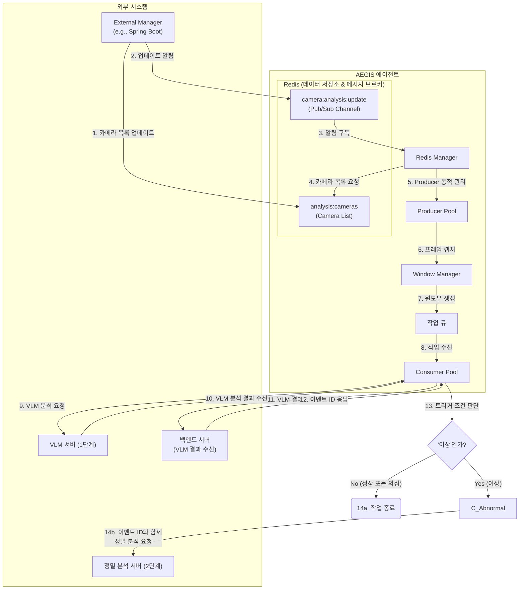

# AEGIS AI Agent

**Simplified Triggered Analytics Pipeline - 간소화된 조건부 분석 시스템**

외부 관리 서버(예: Spring Boot)가 Redis에 등록한 카메라 목록을 동적으로 관리하며, VLM 분석 결과를 백엔드로 전송하고 **이벤트 ID**를 받아, '이상' 조건 충족 시에만 해당 **이벤트 ID와 저해상도 프레임**을 정밀 분석 API로 즉시 전송하는 경량화된 파이프라인 시스템입니다.

## 🎯 시스템 개요

### 간소화된 파이프라인 아키텍처
```
1단계 [VLM 분석]  → 저해상도 → VLM 분석 ┐
                                    ├→ 모든 VLM 결과 백엔드 전송 ┬→ 이벤트 ID 수신
                                    └→ '이상' 판정 ┐             ┘
                                                 ↓ (조건 충족)
2단계 [정밀 분석] → 저해상도 + 이벤트 ID → 정밀 API 즉시 전송 → 상세 분석
```

### 핵심 개념
- **VLM 결과 전송 및 이벤트 ID 수신**: 모든 VLM 분석 결과(정상, 이상 등)를 실시간으로 백엔드 서버에 전송하고, 고유한 **이벤트 ID(Event ID)**를 응답받습니다.
- **조건부 정밀 분석**: VLM이 "이상(abnormal)" 카테고리를 반환할 경우에만, 2단계 정밀 분석을 진행하여 자원을 효율적으로 사용합니다. 이때, 이전에 발급받은 **이벤트 ID**를 함께 전송하여 분석 결과를 연결합니다.
- **Redis 동적 스트림 관리**: 에이전트 재시작 없이 외부 관리 서버가 Redis의 설정을 변경하는 것만으로 분석할 카메라 스트림을 실시간으로 추가하거나 제거할 수 있습니다.

## 주요 기능

### 🎯 핵심 기능
- **VLM 결과 백엔드 전송 및 이벤트 ID 수신**: 모든 1차 분석 결과를 지정된 백엔드 서버로 전송하고, 고유 식별자인 **이벤트 ID**를 돌려받습니다.
- **조건부 2단계 파이프라인**: VLM 분석 후 '이상' 조건 충족 시에만, **이벤트 ID**와 함께 정밀 분석으로 전환됩니다.
- **Redis 동적 스트림 관리**: Redis Pub/Sub을 통해 카메라 목록을 실시간으로 갱신하고 비디오 처리 스레드(Producer)를 동적으로 제어합니다.
- **슬라이딩 윈도우**: 여러 프레임을 하나의 분석 단위(윈도우)로 묶어 처리합니다.
  - **윈도우 크기**: 8초
  - **슬라이딩 간격**: 4초 (50% 오버랩)

### 🛡️ 안정성 기능
- **자동 재연결**: 스트림 또는 외부 서버(VLM, 백엔드 등) 연결 실패 시 지수 백오프(exponential backoff)를 통해 자동으로 재연결을 시도합니다.
- **큐 오버플로우 보호**: 작업 큐가 가득 차면 새로운 작업을 추가하지 않아 시스템 과부하를 방지합니다.
- **버퍼 타임아웃 및 강제 처리**: 특정 시간(기본 30초) 동안 새 프레임이 수신되지 않으면, 버퍼에 쌓인 불완전한 프레임 묶음(최소 5개 이상)을 강제로 분석 큐에 보내 처리합니다.
- **그레이스풀 셧다운**: 시스템 종료 신호(Ctrl+C) 수신 시 모든 컴포넌트를 안전하게 종료합니다.

## 아키텍처

### 아키텍처 다이어그램 (Architecture Diagram)


**워크플로우 설명:**
1.  **카메라 목록 업데이트**: 외부 관리 서버가 Redis의 `analysis:cameras` 키에 분석할 카메라 목록을 저장합니다.
2.  **업데이트 알림**: 관리 서버는 목록 업데이트 후, `camera:analysis:update` 채널에 알림 메시지를 게시합니다.
3.  **알림 구독**: `Redis Manager`는 `camera:analysis:update` 채널을 구독하고 있다가 알림을 수신합니다.
4.  **카메라 목록 조회**: 알림을 받으면, `Redis Manager`는 Redis에서 최신 카메라 목록을 다시 조회합니다.
5.  **Producer 동적 관리**: `Redis Manager`는 조회한 목록을 기반으로 `Producer` 스레드를 동적으로 관리합니다.
6.  **프레임 캡처**: 각 `Producer`는 담당 스트림에서 프레임을 캡처하여 저해상도로 리사이즈합니다.
7.  **윈도우 생성**: `Window Manager`는 프레임들을 모아 분석 단위인 '윈도우'를 생성합니다. (타임아웃 시 강제 처리 기능 포함)
8.  **작업 수신**: `Consumer` 스레드가 `작업 큐`에서 작업을 가져옵니다.
9.  **VLM 분석 요청**: `Consumer`는 저해상도 프레임들을 `VLM 서버`로 보내 1차 분석을 요청합니다.
10. **VLM 결과 수신**: `VLM 서버`로부터 '정상', '의심', '이상' 등의 분석 결과를 받습니다.
11. **백엔드 전송**: `Consumer`는 수신한 **모든 VLM 분석 결과**를 `백엔드 서버`로 전송합니다.
12. **이벤트 ID 수신**: 백엔드 서버로부터 해당 분석 건에 대한 고유 **이벤트 ID**를 응답받습니다.
13. **분기 처리**: `Consumer`는 VLM 결과가 설정된 트리거 조건(예: 'abnormal', '이상')에 해당하는지 확인합니다.
    *   **정상 또는 의심일 경우 (14a)**: 정밀 분석 없이 작업을 종료합니다.
    *   **이상일 경우 (14b)**: 발급받은 **이벤트 ID**와 함께 `정밀 분석 서버`로 2차 분석을 요청합니다.

### 컴포넌트

| 컴포넌트 | 역할 |
|---------|------|
| **Redis Manager** (`redis_manager.py`) | Redis 연결, 카메라 목록 조회, Pub/Sub을 통한 동적 스트림 관리 |
| **Producer** (`producer.py`) | 지정된 스트림에서 프레임을 캡처하고 저해상도로 리사이즈 |
| **Windowing** (`windowing.py`) | 프레임을 수집하여 분석 단위(윈도우)로 만들고 큐에 전송. 타임아웃 시 강제 처리 기능 포함. |
| **Queue Manager** (`queue_manager.py`) | 스레드로부터 안전한 작업 큐 제공 (오버플로우 방지 기능 포함) |
| **Consumer** (`consumer.py`) | 큐에서 작업을 가져와 VLM 분석, 백엔드 전송, 조건부 정밀 분석 등 핵심 워크플로우 실행 |
| **VLM Client** (`vlm_client.py`) | VLM 서버와의 HTTP 통신 담당 |
| **Backend Client** (`backend_client.py`) | 백엔드 서버와의 HTTP 통신 담당. VLM 분석 결과를 전송하고 **이벤트 ID**를 수신합니다. |
| **Precision Client** (`precision_client.py`) | 정밀 분석 서버와의 HTTP 통신 담당. **이벤트 ID**와 함께 분석을 요청합니다. |
| **Mock Servers** (`mock_server.py`) | 개발 및 테스트를 위한 Mock 서버 |

## 설치 및 사용법

### 1. Redis 설정
(내용 동일)

### 2. 에이전트 실행
(내용 동일)

## CLI 인자
(내용 동일)
