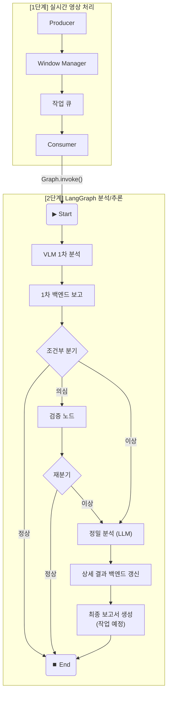
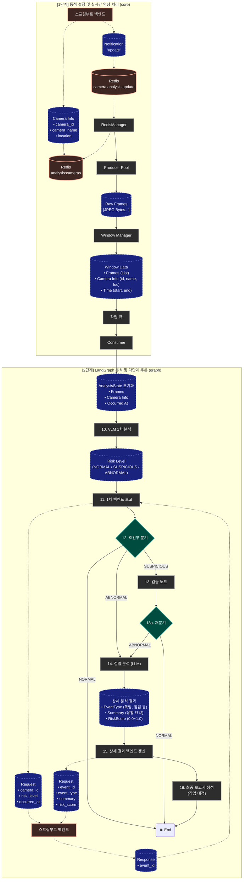

# AEGIS AI Agent

**LangGraph-based Triggered Analytics Pipeline - LangGraph 기반 조건부 분석 시스템**

**스프링부트 백엔드**가 Redis에 등록한 카메라 목록을 동적으로 관리하며, 실시간 영상 프레임을 **LangGraph 기반 파이프라인**으로 처리하여 VLM 분석, 백엔드 보고, 조건부 정밀 분석(LLM) 및 다단계 추론을 수행하는 시스템입니다.

## 🎯 시스템 개요

### 핵심 개념
- **하이브리드 아키텍처**: 고성능이 필수적인 실시간 영상 처리(프레임 캡처, 윈도우 관리)는 기존 Python 스레딩 방식을 유지하고, 복잡한 분석 및 추론 로직은 **LangGraph**를 사용해 명확하고 확장 가능하게 모델링합니다.
- **상태 기반 워크플로우**: 모든 분석 과정은 `AnalysisState`라는 중앙 상태 객체를 통해 데이터를 주고받습니다. 각 분석 단계(노드)는 이 상태를 업데이트하며 다음 단계로 전달합니다.
- **조건부 다단계 추론**: VLM 1차 분석에서 '이상'이 감지되면, 정밀 분석(LLM), 최종 보고서 생성 등 LangGraph로 정의된 다단계 추론 그래프가 순차적으로 실행됩니다.
- **Redis 동적 스트림 관리**: 에이전트 재시작 없이 **스프링부트 백엔드**가 Redis 설정을 변경하여 분석 대상 카메라를 실시간으로 제어합니다.

---

## 🚀 실행 모드 설정

에이전트는 **모의(Mock) 서버 모드**와 **실제(Real) 서버 모드** 두 가지로 실행할 수 있습니다. `src/config.py` 파일의 설정을 변경하여 모드를 전환합니다.

### 1. 모의(Mock) 서버 모드 (개발 및 테스트용)

외부 AI/백엔드 서버 없이 에이전트의 전체 파이프라인 동작을 테스트하기 위한 모드입니다.

#### ⚙️ 설정 방법
1.  `src/config.py` 파일을 엽니다.
2.  `mock_mode` 값을 `True`로 설정합니다.

    ```python
    # config.py
    @dataclass
    class Config:
        # ...
        # Mock 서버
        mock_mode: bool = True  # <--- 이 값을 True로 설정
        # ...
    ```

#### ✅ 동작 방식
- `app.py` 실행 시, 에이전트가 자체적으로 VLM과 정밀 분석 서버를 흉내 내는 **모의 서버를 함께 실행**합니다.
- 에이전트는 `localhost`의 모의 서버와 통신하며, 모의 서버는 무작위로 분석 결과를 생성하여 반환합니다.
- 실제 AI 모델 없이도 LangGraph의 조건부 분기를 포함한 전체 워크플로우를 테스트할 수 있습니다.

### 2. 실제(Real) 서버 모드 (통합 및 운영용)

실제 VLM, LLM, 백엔드 서버와 연동하여 시스템 전체를 운영할 때 사용합니다.

#### ⚙️ 설정 방법
1.  `src/config.py` 파일을 엽니다.
2.  `mock_mode` 값을 `False`로 변경합니다.
3.  **각 실제 서버의 주소에 맞게 엔드포인트(endpoint) 설정을 모두 수정합니다.**

    ```python
    # config.py
    @dataclass
    class Config:
        # ...
        # 실제 서버 주소로 변경
        vlm_endpoint: str = "http://<실제 VLM 서버 IP>:8001/analyze"
        precision_endpoint: str = "http://<실제 LLM 서버 IP>:8002/precision_analyze"
        backend_endpoint: str = "http://<실제 백엔드 서버 IP>:8080/api/vlm-results"
        # ...
        # Mock 서버 비활성화
        mock_mode: bool = False  # <--- 이 값을 False로 설정
        # ...
    ```

#### ✅ 동작 방식
- `app.py` 실행 시, `mock_mode`가 `False`이므로 모의 서버를 실행하지 않습니다.
- 에이전트는 `config.py`에 설정된 **실제 서버 주소**로 HTTP 요청을 보냅니다.

### 실행 전 공통 준비 사항
어떤 모드로 실행하든 아래 사항은 준비되어야 합니다.
1.  **Redis 서버**: `config.py`에 설정된 주소에서 실행 중이어야 합니다.
2.  **Redis 데이터**: `redis-cli`를 사용하여 분석할 카메라 정보를 `analysis:cameras` 키에 등록해야 합니다.
    ```sh
    # 예시: streamid가 local_video인 카메라 정보 등록
    SADD analysis:cameras '{"id": "local_video", "name": "Test Cam", "location": "Office"}'
    ```
3.  **영상 소스**: Redis에 등록한 `camera_id`에 해당하는 RTSP 스트림 또는 로컬 비디오 파일이 필요합니다.

---

## 🔄 상세 워크플로우 (Workflow)

시스템의 전체 동작 흐름은 크게 **실시간 영상 처리**와 **LangGraph 분석/추론** 두 단계로 나뉩니다.

### 1. 개요 다이어그램 (Simple Workflow)
전체적인 처리 단계의 흐름을 간략하게 보여줍니다.



### 2. 상세 다이어그램 (Detailed Workflow with Data Flow)
각 단계에서 어떤 데이터가 생성되고 전달되는지를 상세하게 보여줍니다.

> **범례**: ⬜ 처리 단계(Process) | 🟦 데이터 객체(Data) | 🟧 외부 시스템(External)



### [1단계] 동적 설정 및 실시간 영상 처리 (`core` 패키지)
고성능 처리를 위해 일반적인 Python 멀티스레딩 방식으로 동작하며, `core` 패키지의 모듈들이 담당합니다.

1.  **카메라 정보 변경 (스프링부트 백엔드)**: 백엔드에서 관리자가 분석할 카메라 정보를 Redis의 `analysis:cameras` 키(Set 자료구조)에 업데이트합니다. 각 카메라는 `camera_id`, `camera_name`, `camera_location` 등의 정보를 포함할 수 있습니다.
2.  **변경 알림 발행 (스프링부트 백엔드)**: 정보 업데이트 후, 백엔드는 Redis의 `camera:analysis:update` 채널에 "update"와 같은 메시지를 **발행(Publish)**합니다.
3.  **알림 수신 (`RedisManager`)**: 에이전트의 `RedisManager`는 항상 `camera:analysis:update` 채널을 **구독(Subscribe)**하고 있다가, 메시지가 들어오면 즉시 감지합니다.
4.  **카메라 목록 동기화 (`RedisManager`)**: 알림을 수신한 `RedisManager`는 Redis의 `analysis:cameras` 키에서 최신 카메라 정보 목록을 다시 가져옵니다.
5.  **프로듀서 동적 관리 (`RedisManager` -> `ProducerPool`)**: `RedisManager`는 현재 실행 중인 `Producer` 스레드 목록과 새로 가져온 카메라 목록을 비교하여, 더 이상 목록에 없는 카메라는 `Producer`를 중지시키고, 새로 추가된 카메라는 새로운 `Producer`를 시작합니다.
6.  **프레임 캡처 및 리사이징 (`Producer`)**: 각 `Producer` 스레드는 담당하는 RTSP 스트림에서 프레임을 지속적으로 캡처하고, 분석에 적합한 저해상도 이미지로 변환합니다.
7.  **윈도우 구성 (`WindowManager`)**: `Producer`가 전달한 프레임들을 시간 순서대로 수집하여, **8초 길이의 프레임 묶음(윈도우)**을 생성합니다. (슬라이딩 간격: 4초)
8.  **작업 생성 및 큐잉 (`WindowManager` -> `QueueManager`)**: 생성된 윈도우(프레임 묶음)와 메타데이터(카메라 정보, 윈도우 시작/종료 시간)를 하나의 '작업(task)'으로 만들어 `QueueManager`의 작업 큐에 추가합니다.

### [2단계] LangGraph 분석 및 다단계 추론 (`graph` 패키지)
`Consumer`가 큐에서 작업을 가져오면서 복잡한 의사결정과 추론을 담당하는 LangGraph 파이프라인이 시작됩니다.

9.  **그래프 실행 (`Consumer`)**: 대기 중이던 `Consumer` 스레드가 큐에서 작업을 가져옵니다. 작업 정보를 바탕으로 `AnalysisState` 초기 상태를 구성하고, `graph.invoke()`를 호출하여 그래프를 실행합니다.
10. **1차 VLM 분석 (노드: `vlm_analysis`)**:
    *   `vlm_client`를 사용하여 VLM 서버에 프레임 묶음을 전송합니다.
    *   결과로 `risk_level` ('NORMAL', 'SUSPICIOUS', 'ABNORMAL')을 도출하여 `AnalysisState`에 저장합니다.
11. **1차 백엔드 보고 (노드: `backend_report`)**:
    *   `backend_client`를 사용하여 1차 분석 결과(`camera_id`, `risk_level`, `occurred_at`)를 **스프링부트 백엔드**로 전송합니다.
    *   백엔드로부터 고유한 **`event_id`**를 응답받아 `AnalysisState`에 저장합니다.
12. **조건부 분기 (엣지: `router`)**:
    *   `AnalysisState`의 `risk_level`을 확인하여 다음 경로를 결정합니다.
        *   **'NORMAL'**: 분석할 필요가 없으므로 워크플로우를 즉시 종료합니다.
        *   **'SUSPICIOUS'**: 추가적인 검증이 필요하므로 '검증' 노드로 분기합니다.
        *   **'ABNORMAL'**: 명백한 이상 상황이므로 '정밀 분석 (LLM)' 노드로 즉시 분기합니다.
13. **검증 (노드: `verification`)** (SUSPICIOUS 경로):
    *   '의심' 상황에 대한 추가적인 판단을 수행하여 `risk_level`을 'NORMAL' 또는 'ABNORMAL'로 재설정하고, 재분기합니다.
14. **정밀 분석 (LLM) (노드: `precision_analysis`)**:
    *   `precision_client`를 사용하여 정밀 분석 서버에 프레임 묶음과 `event_id`를 전송합니다.
    *   LLM을 통해 구체적인 **`event_type`**, **`summary`**, **`risk_score`** 등을 한 번에 분석하여 `AnalysisState`에 저장합니다.
15. **상세 결과 백엔드 갱신 (노드: `update_backend`)**:
    *   `backend_client`를 사용하여 `event_id`와 함께 상세 분석 결과(`event_type`, `summary`, `risk_score`)를 **스프링부트 백엔드**로 전송합니다.
    *   백엔드는 이 정보로 기존 이벤트를 **덮어쓰기(갱신)**합니다.
16. **최종 보고서 생성 (노드: `generate_report`) - (작업 예정)**:
    *   **RAG(검색 증강 생성)** 기능을 수행하는 LLM 에이전트로 구성될 예정입니다.
    *   LLM이 모든 분석 결과와 `retrieval` 도구를 통해 얻은 정보(대응 매뉴얼 등)를 종합하여 최종 상세 보고서를 작성하고, `AnalysisState`의 `report` 필드를 업데이트할 것입니다.
17. **워크플로우 종료 (END)**: 모든 분석이 완료된 최종 `AnalysisState`를 반환하며 그래프 실행이 종료됩니다.

---

## 🤖 LangGraph 파이프라인 상태

### `src/graph/state.py`: AnalysisState 정의

그래프의 모든 노드(단계)가 공유하고 업데이트하는 중앙 데이터 구조입니다. `TypedDict`를 사용하여 각 데이터의 타입을 명확하게 정의합니다.

```python
from typing import TypedDict, List, Optional, Literal
from datetime import datetime

# 1차 분류: VLM 분석 결과
RiskLevel = Literal["NORMAL", "SUSPICIOUS", "ABNORMAL"]

# 2차 분류: 정밀 분석 이벤트 유형
EventType = Literal["ASSAULT", "BURGLARY", "DUMP", "SWOON", "VANDALISM"]

class AnalysisState(TypedDict):
    """LangGraph 분석 파이프라인의 상태를 정의하는 TypedDict"""

    # --- 초기 입력 ---
    camera_id: str
    camera_name: str
    camera_location: str
    occurred_at: datetime
    frames: List[bytes]
    
    # --- 워크플로우 진행 중 생성 ---
    event_id: str
    
    # --- 분석 결과 ---
    risk_level: RiskLevel
    event_type: EventType
    summary: str
    risk_score: float
    report: str             # -- 작업중 -- (보고서 생성 LLM 결과)
    
    # --- 메타 데이터 ---
    actions: list           # -- 작업중 --
    rag_references: list    # -- 작업중 --
    errors: List[str]
```

---

## 📁 디렉토리 구조 (LangGraph 적용 후)

```
aegis-ai-agent/src/
│
├── __init__.py
├── app.py               # 🚀 에이전트 실행의 주 진입점
├── config.py            # ⚙️ 전역 설정
├── utils.py             # 🛠️ 공용 유틸리티 함수
│
├── core/                  # 🧠 에이전트 핵심 파이프라인 (실시간 처리)
│   ├── __init__.py
│   ├── consumer.py        # - 작업 오케스트레이션 (LangGraph 트리거)
│   ├── producer.py        # - 비디오 스트림 프레임 캡처
│   ├── windowing.py       # - 프레임 윈도우 관리
│   ├── queue_manager.py   # - 작업 큐 관리
│   └── redis_manager.py   # - Redis 연동 및 동적 카메라 관리
│
├── clients/               # 📡 외부 서비스 통신 클라이언트
│   ├── __init__.py
│   ├── backend_client.py  # - Aegis 백엔드 API 클라이언트
│   ├── precision_client.py# - 정밀 분석 API 클라이언트
│   ├── vlm_client.py      # - VLM API 클라이언트
│   └── vector_store_client.py # - Vector DB 클라이언트 (RAG용)
│
├── graph/                 # 🤖 LangGraph 기반 다단계 분석/추론 계층
│   ├── __init__.py
│   ├── analysis_graph.py  # - 메인 분석 워크플로우(그래프) 빌더
│   ├── state.py           # - 그래프의 상태(AnalysisState) 객체 정의
│   │
│   ├── nodes/             # 📄 그래프의 각 '단계' (기능별 파일 분리)
│   │   ├── __init__.py
│   │   ├── vlm_analysis.py       # 1. VLM 1차 분석
│   │   ├── precision_analysis.py # 2. 정밀 분석 (LLM)
│   │   ├── update_backend.py     # 3. 백엔드 갱신
│   │   └── generate_report.py    # 4. RAG 기반 최종 보고서 생성
│   │
│   └── edges/             # ↪️ 그래프의 '흐름 제어'
│       ├── __init__.py
│       └── routers.py     # - 조건부 분기 로직
│
├── retrieval/             # 📚 RAG 및 검색 관련 기능
│   ├── __init__.py
│   ├── retriever_factory.py # - Retriever 객체 생성 (Vector DB와 연결)
│   ├── indexer.py           # - 외부 문서(매뉴얼 등)를 임베딩하고 DB에 저장
│   │
│   └── tools/               # 🛠️ LangGraph 노드에서 사용할 도구
│       ├── __init__.py
│       ├── search_manual_tool.py     # - '대응 매뉴얼 검색' 도구
│       └── search_past_cases_tool.py # - '유사 과거 사례 검색' 도구
│
└── api/                   # 🌐 에이전트 자체 API 서버 (상태 조회 등)
    ├── __init__.py
    ├── api_server.py      # - 에이전트 상태 조회를 위한 API 서버
    └── mock_server.py     # - 외부 서비스 Mock 서버
```
