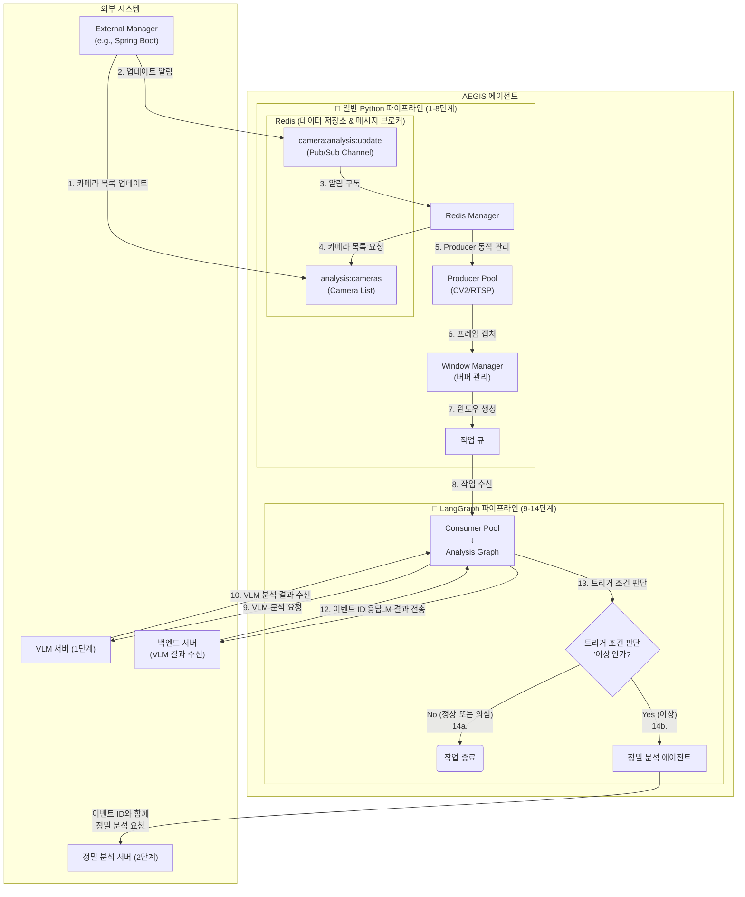

# AEGIS AI Agent

**Simplified Triggered Analytics Pipeline - 간소화된 조건부 분석 시스템**

외부 관리 서버(예: Spring Boot)가 Redis에 등록한 카메라 목록을 동적으로 관리하며, VLM 분석 결과를 백엔드로 전송하고 **이벤트 ID**를 받아, '이상' 조건 충족 시에만 해당 **이벤트 ID와 저해상도 프레임**을 정밀 분석 API로 즉시 전송하는 경량화된 파이프라인 시스템입니다.

## 🎯 시스템 개요

### 간소화된 파이프라인 아키텍처
```
1단계 [VLM 분석]  → 저해상도 → VLM 분석 ┐
                                    ├→ 모든 VLM 결과 백엔드 전송 ┬→ 이벤트 ID 수신
                                    └→ '이상' 판정 ┐             ┘
                                                 ↓ (조건 충족)
2단계 [정밀 분석] → 저해상도 + 이벤트 ID → 정밀 API 즉시 전송 → 상세 분석
```

### 핵심 개념
- **VLM 결과 전송 및 이벤트 ID 수신**: 모든 VLM 분석 결과(정상, 이상 등)를 실시간으로 백엔드 서버에 전송하고, 고유한 **이벤트 ID(Event ID)**를 응답받습니다.
- **조건부 정밀 분석**: VLM이 "이상(abnormal)" 카테고리를 반환할 경우에만, 2단계 정밀 분석을 진행하여 자원을 효율적으로 사용합니다. 이때, 이전에 발급받은 **이벤트 ID**를 함께 전송하여 분석 결과를 연결합니다.
- **Redis 동적 스트림 관리**: 에이전트 재시작 없이 외부 관리 서버가 Redis의 설정을 변경하는 것만으로 분석할 카메라 스트림을 실시간으로 추가하거나 제거할 수 있습니다.

## 주요 기능

### 🎯 핵심 기능
- **VLM 결과 백엔드 전송 및 이벤트 ID 수신**: 모든 1차 분석 결과를 지정된 백엔드 서버로 전송하고, 고유 식별자인 **이벤트 ID**를 돌려받습니다.
- **조건부 2단계 파이프라인**: VLM 분석 후 '이상' 조건 충족 시에만, **이벤트 ID**와 함께 정밀 분석으로 전환됩니다.
- **Redis 동적 스트림 관리**: Redis Pub/Sub을 통해 카메라 목록을 실시간으로 갱신하고 비디오 처리 스레드(Producer)를 동적으로 제어합니다.
- **슬라이딩 윈도우**: 여러 프레임을 하나의 분석 단위(윈도우)로 묶어 처리합니다.
  - **윈도우 크기**: 8초
  - **슬라이딩 간격**: 4초 (50% 오버랩)

### 🛡️ 안정성 기능
- **자동 재연결**: 스트림 또는 외부 서버(VLM, 백엔드 등) 연결 실패 시 지수 백오프(exponential backoff)를 통해 자동으로 재연결을 시도합니다.
- **큐 오버플로우 보호**: 작업 큐가 가득 차면 새로운 작업을 추가하지 않아 시스템 과부하를 방지합니다.
- **버퍼 타임아웃 및 강제 처리**: 특정 시간(기본 30초) 동안 새 프레임이 수신되지 않으면, 버퍼에 쌓인 불완전한 프레임 묶음(최소 5개 이상)을 강제로 분석 큐에 보내 처리합니다.
- **그레이스풀 셧다운**: 시스템 종료 신호(Ctrl+C) 수신 시 모든 컴포넌트를 안전하게 종료합니다.

---

## 아키텍처

### 🎯 명확한 경계 구분: 일반 Python vs LangGraph

```
┌─────────────────────────────────────────────────────────────────────┐
│  일반 Python (기존 유지) - 1~8단계                                    │
│  ━━━━━━━━━━━━━━━━━━━━━━━━━━━━━━━━━━━━━━━━━━━━━━━━━━━━━━━━━━━━━━━  │
│                                                                     │
│  ┌────────────┐   ┌────────────┐   ┌────────────┐                 │
│  │ Producer   │   │  Window    │   │   Queue    │                 │
│  │ (CV2/RTSP) │──▶│  Manager   │──▶│  Manager   │                 │
│  │            │   │ (버퍼 생성)  │   │            │                 │
│  └────────────┘   └────────────┘   └────────────┘                 │
│       │                 │                 │                        │
│       │                 │                 │                        │
│       └─────────────────┴─────────────────┘                        │
│                         ▼                                          │
│                  ┌────────────┐                                    │
│                  │ Consumer   │ ◀─── 스레드 풀에서 작업 가져옴       │
│                  │ 워커 스레드  │                                   │
│                  └────────────┘                                    │
│                         │                                          │
└─────────────────────────┼──────────────────────────────────────────┘
                          │
                          ▼ task = queue.get()
┌─────────────────────────┼──────────────────────────────────────────┐
│  🤖 LangGraph (새로 작성) - 9~14단계                                  │
│  ━━━━━━━━━━━━━━━━━━━━━━▼━━━━━━━━━━━━━━━━━━━━━━━━━━━━━━━━━━━━━━━  │
│                                                                     │
│            graph.invoke({                                          │
│                camera_id: task['camera_id'],                       │
│                frames: task['low_res_frames']                      │
│            })                                                       │
│                         │                                          │
│                         ▼                                          │
│            ┌──────────────────────────┐                            │
│            │   vlm_analysis_node      │ ◀─── VLM API 호출          │
│            └──────────────────────────┘                            │
│                         │                                          │
│                         ▼                                          │
│            ┌──────────────────────────┐                            │
│            │   backend_report_node    │ ◀─── 백엔드 전송            │
│            └──────────────────────────┘                            │
│                         │                                          │
│                         ▼                                          │
│            ┌──────────────────────────┐                            │
│            │   conditional_router     │ ◀─── 조건 분기 (이상 여부)   │
│            └──────────────────────────┘                            │
│                    /          \                                    │
│                   /            \                                   │
│         [정상]   /              \  [이상]                            │
│                 /                \                                 │
│                ▼                  ▼                                │
│            ┌────┐    ┌──────────────────────────┐                 │
│            │END │    │  precision_agent_node    │ ◀─── LLM 에이전트│
│            └────┘    │  (LLM 기반 의사결정 +    │                  │
│                      │   정밀 분석 API 호출)     │                  │
│                      └──────────────────────────┘                  │
│                                  │                                 │
│                                  ▼                                 │
│                              ┌────┐                                │
│                              │END │                                │
│                              └────┘                                │
│                                                                     │
└─────────────────────────────────────────────────────────────────────┘
```

### 아키텍처 다이어그램 (Architecture Diagram)



### 워크플로우 설명

**🔧 일반 Python 파이프라인 (1-8단계):**
1.  **카메라 목록 업데이트**: 외부 관리 서버가 Redis의 `analysis:cameras` 키에 분석할 카메라 목록을 저장합니다.
2.  **업데이트 알림**: 관리 서버는 목록 업데이트 후, `camera:analysis:update` 채널에 알림 메시지를 게시합니다.
3.  **알림 구독**: `Redis Manager`는 `camera:analysis:update` 채널을 구독하고 있다가 알림을 수신합니다.
4.  **카메라 목록 조회**: 알림을 받으면, `Redis Manager`는 Redis에서 최신 카메라 목록을 다시 조회합니다.
5.  **Producer 동적 관리**: `Redis Manager`는 조회한 목록을 기반으로 `Producer` 스레드를 동적으로 관리합니다.
6.  **프레임 캡처**: 각 `Producer`는 담당 스트림에서 프레임을 캡처하여 저해상도로 리사이즈합니다. (CV2 사용)
7.  **윈도우 생성**: `Window Manager`는 프레임들을 모아 분석 단위인 '윈도우'를 생성합니다. (타임아웃 시 강제 처리 기능 포함)
8.  **작업 수신**: `Consumer` 스레드가 `작업 큐`에서 작업을 가져옵니다.

**🤖 LangGraph 파이프라인 (9-14단계):**
9.  **VLM 분석 요청**: `Consumer`는 저해상도 프레임들을 `VLM 서버`로 보내 1차 분석을 요청합니다.
10. **VLM 결과 수신**: `VLM 서버`로부터 '정상', '의심', '이상' 등의 분석 결과를 받습니다.
11. **백엔드 전송**: `Consumer`는 수신한 **모든 VLM 분석 결과**를 `백엔드 서버`로 전송합니다.
12. **이벤트 ID 수신**: 백엔드 서버로부터 해당 분석 건에 대한 고유 **이벤트 ID**를 응답받습니다.
13. **분기 처리**: `Consumer`는 VLM 결과가 설정된 트리거 조건(예: 'abnormal', '이상')에 해당하는지 확인합니다.
14. **조건부 정밀 분석**:
    *   **정상 또는 의심일 경우 (14a)**: 정밀 분석 없이 작업을 종료합니다.
    *   **이상일 경우 (14b)**: 발급받은 **이벤트 ID**와 함께 `정밀 분석 서버`로 2차 분석을 요청합니다.

---

## 🏗️ LangGraph 도입 방식 비교

### 방식 1️⃣: 전체 시스템을 LangGraph로 만들기

```python
# 전체가 LangGraph 노드
graph = StateGraph(PipelineState)
graph.add_node("capture_frames", capture_frames_node)      # 일반 노드
graph.add_node("create_window", window_manager_node)       # 일반 노드
graph.add_node("vlm_analysis", vlm_node)                   # 일반 노드
graph.add_node("send_to_backend", backend_node)            # 일반 노드
graph.add_node("precision_agent", precision_agent)         # AI 에이전트 노드
```

| 장점 | 단점 |
|------|------|
| 통합 오케스트레이션 | 프레임 캡처에 불필요한 오버헤드 |
| LangGraph Studio 시각화 | Producer 성능 저하 우려 |
| 체크포인팅/장애 복구 | 다중 카메라 병렬 처리 어려움 |
| 일관된 에러 처리 | 기존 코드 전체 재작성 필요 |

### 방식 2️⃣: 에이전트 부분만 LangGraph 적용 (✅ 권장)

```
[기존 파이프라인 유지]                    [LangGraph 적용]
Producer → WindowManager → Queue → ┌──────────────────────────┐
                                   │  LangGraph Agent         │
                                   │  ┌─────────────────────┐  │
                                   │  │ vlm_analysis        │  │
                                   │  │ → backend_report    │  │
                                   │  │ → conditional_router│  │
                                   │  │ → precision_agent   │  │
                                   │  └─────────────────────┘  │
                                   └──────────────────────────┘
```

| 장점 | 단점 |
|------|------|
| 관심사 분리 (I/O vs AI) | 두 가지 패러다임 공존 |
| 점진적 도입 가능 | 전체 플로우 시각화 부분적 |
| 고성능 유지 | |
| 에이전트 로직 독립 발전 | |

### 🏆 비교 결론

| 기준 | 전체 LangGraph | 에이전트만 LangGraph |
|------|---------------|---------------------|
| **성능** | ❌ 오버헤드 | ✅ 최적 |
| **개발 비용** | ❌ 전체 재작성 | ✅ 최소 변경 |
| **LangGraph 적합성** | ⚠️ I/O에 부적합 | ✅ 의사결정에 최적 |
| **확장성** | ⚠️ 복잡 | ✅ 에이전트만 발전 |
| **유지보수** | ❌ 높은 복잡도 | ✅ 관심사 분리 |

**결론: 방식 2️⃣ (9번 VLM 분석 요청부터 LangGraph 적용) 권장**

---

## 📁 디렉토리 구조 (LangGraph 적용 후)

```
aegis-ai-agent/
├── requirements.txt                    # 의존성 (langgraph, langchain 등 추가)
├── pyproject.toml                      # 프로젝트 설정
├── README.md
├── docs/
│   └── ...
│
├── src/
│   ├── __init__.py
│   ├── main.py                         # 메인 진입점
│   ├── config.py                       # 환경 설정
│   ├── utils.py                        # 유틸리티 함수
│   │
│   ├── # ─────────────────────────────────────────────────
│   ├── # 🔧 일반 Python 파이프라인 (기존 유지)
│   ├── # ─────────────────────────────────────────────────
│   ├── redis_manager.py                # Redis 연결 및 Pub/Sub
│   ├── producer.py                     # CV2/RTSP 프레임 캡처
│   ├── windowing.py                    # 슬라이딩 윈도우 버퍼 관리
│   ├── queue_manager.py                # 스레드 안전 큐
│   ├── consumer.py                     # 워커 스레드 (LangGraph 호출부)
│   │
│   ├── # ─────────────────────────────────────────────────
│   ├── # 🤖 LangGraph 파이프라인 (새로 작성)
│   ├── # ─────────────────────────────────────────────────
│   ├── graph/                          # LangGraph 관련 모듈
│   │   ├── __init__.py
│   │   ├── state.py                    # 상태 정의 (TypedDict)
│   │   ├── analysis_graph.py           # 메인 분석 그래프
│   │   ├── nodes/                      # 개별 노드 구현
│   │   │   ├── __init__.py
│   │   │   ├── vlm_node.py             # VLM 분석 노드
│   │   │   ├── backend_node.py         # 백엔드 전송 노드
│   │   │   └── precision_node.py       # 정밀 분석 에이전트 노드
│   │   ├── edges/                      # 조건부 엣지 (라우터)
│   │   │   ├── __init__.py
│   │   │   └── routers.py              # 분기 조건 함수들
│   │   └── tools/                      # LLM 에이전트용 도구
│   │       ├── __init__.py
│   │       ├── precision_tool.py       # 정밀 분석 API 호출 도구
│   │       └── notification_tool.py    # 알림 전송 도구
│   │
│   ├── # ─────────────────────────────────────────────────
│   ├── # 🔌 외부 API 클라이언트 (기존 유지, 일부 수정)
│   ├── # ─────────────────────────────────────────────────
│   ├── clients/                        # 외부 API 클라이언트 (리팩토링)
│   │   ├── __init__.py
│   │   ├── vlm_client.py               # VLM API 클라이언트
│   │   ├── backend_client.py           # 백엔드 API 클라이언트
│   │   └── precision_client.py         # 정밀 분석 API 클라이언트
│   │
│   └── mock_server.py                  # 테스트용 Mock 서버
│
└── tests/
    ├── __init__.py
    ├── test_graph/                     # LangGraph 테스트
    │   ├── test_analysis_graph.py
    │   ├── test_nodes.py
    │   └── test_routers.py
    └── test_pipeline/                  # 기존 파이프라인 테스트
        ├── test_producer.py
        └── test_windowing.py
```

---

## 💻 구현 가이드

### Phase 1: 상태 및 기본 그래프 구조 정의

#### `src/graph/state.py` - 상태 정의
```python
"""LangGraph 분석 파이프라인 상태 정의"""
from typing import TypedDict, List, Optional, Any
from datetime import datetime


class AnalysisState(TypedDict):
    """분석 파이프라인의 상태를 정의하는 TypedDict"""
    
    # 입력 데이터
    camera_id: str
    frames: List[bytes]                 # JPEG 인코딩된 프레임들
    window_start: datetime
    window_end: datetime
    
    # VLM 분석 결과
    vlm_result: Optional[dict]          # VLM API 응답
    vlm_category: Optional[str]         # 'normal', 'suspicious', 'abnormal'
    vlm_confidence: Optional[float]     # 신뢰도 (0.0 ~ 1.0)
    vlm_description: Optional[str]      # 상황 설명
    
    # 백엔드 통신 결과
    backend_sent: bool                  # 백엔드 전송 완료 여부
    event_id: Optional[str]             # 백엔드에서 발급한 이벤트 ID
    
    # 정밀 분석 결과
    precision_triggered: bool           # 정밀 분석 트리거 여부
    precision_result: Optional[dict]    # 정밀 분석 API 응답
    
    # 에러 추적
    errors: List[str]                   # 발생한 에러 목록
```

#### `src/graph/analysis_graph.py` - 메인 그래프
```python
"""AEGIS 분석 파이프라인 LangGraph 구현"""
from langgraph.graph import StateGraph, END
from langgraph.checkpoint.memory import MemorySaver

from .state import AnalysisState
from .nodes.vlm_node import vlm_analysis_node
from .nodes.backend_node import backend_report_node
from .nodes.precision_node import precision_agent_node
from .edges.routers import should_trigger_precision


def create_analysis_graph(
    vlm_client,
    backend_client,
    precision_client,
    checkpointer=None
):
    """
    분석 파이프라인 그래프를 생성합니다.
    
    Args:
        vlm_client: VLM API 클라이언트
        backend_client: 백엔드 API 클라이언트
        precision_client: 정밀 분석 API 클라이언트
        checkpointer: 상태 체크포인터 (선택사항)
    
    Returns:
        컴파일된 LangGraph 인스턴스
    """
    # 클라이언트 의존성 주입을 위한 클로저
    def vlm_node(state: AnalysisState) -> AnalysisState:
        return vlm_analysis_node(state, vlm_client)
    
    def backend_node(state: AnalysisState) -> AnalysisState:
        return backend_report_node(state, backend_client)
    
    def precision_node(state: AnalysisState) -> AnalysisState:
        return precision_agent_node(state, precision_client)
    
    # 그래프 구성
    graph = StateGraph(AnalysisState)
    
    # 노드 추가
    graph.add_node("vlm_analysis", vlm_node)
    graph.add_node("backend_report", backend_node)
    graph.add_node("precision_agent", precision_node)
    
    # 엣지 연결
    graph.set_entry_point("vlm_analysis")
    graph.add_edge("vlm_analysis", "backend_report")
    
    # 조건부 분기: 정밀 분석 필요 여부
    graph.add_conditional_edges(
        "backend_report",
        should_trigger_precision,
        {
            "precision": "precision_agent",
            "end": END
        }
    )
    graph.add_edge("precision_agent", END)
    
    # 체크포인터 설정 (선택사항)
    if checkpointer is None:
        checkpointer = MemorySaver()
    
    return graph.compile(checkpointer=checkpointer)


class AnalysisGraphRunner:
    """Consumer에서 사용하기 위한 그래프 실행 래퍼"""
    
    def __init__(self, vlm_client, backend_client, precision_client):
        self.graph = create_analysis_graph(
            vlm_client, backend_client, precision_client
        )
    
    def invoke(self, task: dict) -> dict:
        """
        Consumer에서 호출하는 메인 진입점
        
        Args:
            task: 큐에서 가져온 작업 딕셔너리
                - camera_id: str
                - low_res_frames: List[bytes]
                - window_start: datetime
                - window_end: datetime
        
        Returns:
            분석 완료된 상태 딕셔너리
        """
        initial_state: AnalysisState = {
            "camera_id": task["camera_id"],
            "frames": task["low_res_frames"],
            "window_start": task.get("window_start"),
            "window_end": task.get("window_end"),
            "vlm_result": None,
            "vlm_category": None,
            "vlm_confidence": None,
            "vlm_description": None,
            "backend_sent": False,
            "event_id": None,
            "precision_triggered": False,
            "precision_result": None,
            "errors": []
        }
        
        # 그래프 실행
        config = {"configurable": {"thread_id": task["camera_id"]}}
        return self.graph.invoke(initial_state, config)
```

### Phase 2: 노드 구현

#### `src/graph/nodes/vlm_node.py`
```python
"""VLM 분석 노드"""
import logging
from typing import TYPE_CHECKING

if TYPE_CHECKING:
    from ..state import AnalysisState
    from ...clients.vlm_client import VLMClient

logger = logging.getLogger("aegis-agent.graph.vlm_node")


def vlm_analysis_node(state: "AnalysisState", vlm_client: "VLMClient") -> "AnalysisState":
    """
    VLM API를 호출하여 프레임을 분석합니다.
    
    Args:
        state: 현재 파이프라인 상태
        vlm_client: VLM API 클라이언트
    
    Returns:
        VLM 분석 결과가 추가된 상태
    """
    camera_id = state["camera_id"]
    frames = state["frames"]
    
    logger.debug(f"[{camera_id}] VLM 분석 시작 (프레임 수: {len(frames)})")
    
    try:
        # VLM API 호출
        task_metadata = {
            "window_start": state["window_start"],
            "window_end": state["window_end"]
        }
        vlm_result = vlm_client.analyze_frames(camera_id, frames, task_metadata)
        
        if vlm_result is None:
            logger.warning(f"[{camera_id}] VLM 분석 실패")
            return {
                **state,
                "errors": state["errors"] + ["VLM 분석 실패"]
            }
        
        logger.info(
            f"[{camera_id}] VLM 분석 완료 - "
            f"카테고리: {vlm_result.get('primary_category', 'unknown')}"
        )
        
        return {
            **state,
            "vlm_result": vlm_result,
            "vlm_category": vlm_result.get("primary_category", "unknown").lower(),
            "vlm_confidence": vlm_result.get("confidence", 0.0),
            "vlm_description": vlm_result.get("description", "")
        }
        
    except Exception as e:
        logger.error(f"[{camera_id}] VLM 노드 에러: {e}", exc_info=True)
        return {
            **state,
            "errors": state["errors"] + [f"VLM 노드 에러: {str(e)}"]
        }
```

#### `src/graph/nodes/backend_node.py`
```python
"""백엔드 전송 노드"""
import logging
from typing import TYPE_CHECKING

if TYPE_CHECKING:
    from ..state import AnalysisState
    from ...clients.backend_client import BackendClient

logger = logging.getLogger("aegis-agent.graph.backend_node")


def backend_report_node(state: "AnalysisState", backend_client: "BackendClient") -> "AnalysisState":
    """
    VLM 분석 결과를 백엔드 서버로 전송하고 이벤트 ID를 수신합니다.
    
    Args:
        state: 현재 파이프라인 상태
        backend_client: 백엔드 API 클라이언트
    
    Returns:
        백엔드 전송 결과가 추가된 상태
    """
    camera_id = state["camera_id"]
    vlm_result = state["vlm_result"]
    
    # VLM 결과가 없으면 스킵
    if vlm_result is None:
        logger.warning(f"[{camera_id}] VLM 결과 없음 - 백엔드 전송 스킵")
        return state
    
    logger.debug(f"[{camera_id}] 백엔드 전송 시작")
    
    try:
        # 백엔드 API 호출
        task_metadata = {
            "window_start": state["window_start"],
            "window_end": state["window_end"]
        }
        response = backend_client.send_vlm_result(camera_id, vlm_result, task_metadata)
        
        # 이벤트 ID 추출
        event_id = None
        if response:
            event_id = response.get("event_id") or response.get("id")
        
        logger.info(f"[{camera_id}] 백엔드 전송 완료 - 이벤트 ID: {event_id}")
        
        return {
            **state,
            "backend_sent": True,
            "event_id": event_id
        }
        
    except Exception as e:
        logger.error(f"[{camera_id}] 백엔드 노드 에러: {e}", exc_info=True)
        return {
            **state,
            "backend_sent": False,
            "errors": state["errors"] + [f"백엔드 노드 에러: {str(e)}"]
        }
```

#### `src/graph/nodes/precision_node.py`
```python
"""정밀 분석 에이전트 노드"""
import logging
from typing import TYPE_CHECKING

if TYPE_CHECKING:
    from ..state import AnalysisState
    from ...clients.precision_client import PrecisionClient

logger = logging.getLogger("aegis-agent.graph.precision_node")


def precision_agent_node(state: "AnalysisState", precision_client: "PrecisionClient") -> "AnalysisState":
    """
    정밀 분석 API를 호출합니다.
    추후 LLM 기반 의사결정 에이전트로 확장 가능합니다.
    
    Args:
        state: 현재 파이프라인 상태
        precision_client: 정밀 분석 API 클라이언트
    
    Returns:
        정밀 분석 결과가 추가된 상태
    """
    camera_id = state["camera_id"]
    event_id = state["event_id"]
    frames = state["frames"]
    vlm_result = state["vlm_result"]
    
    logger.info(f"[{camera_id}] 정밀 분석 시작 (이벤트 ID: {event_id})")
    
    try:
        # 정밀 분석 API 호출
        task_metadata = {
            "window_start": state["window_start"],
            "window_end": state["window_end"],
            "event_id": event_id
        }
        precision_result = precision_client.send_for_analysis(
            camera_id, frames, vlm_result, task_metadata
        )
        
        if precision_result:
            logger.info(f"[{camera_id}] 정밀 분석 완료")
        else:
            logger.warning(f"[{camera_id}] 정밀 분석 실패")
        
        return {
            **state,
            "precision_triggered": True,
            "precision_result": precision_result
        }
        
    except Exception as e:
        logger.error(f"[{camera_id}] 정밀 분석 노드 에러: {e}", exc_info=True)
        return {
            **state,
            "precision_triggered": True,
            "errors": state["errors"] + [f"정밀 분석 노드 에러: {str(e)}"]
        }
```

### Phase 3: 라우터 (조건부 분기) 구현

#### `src/graph/edges/routers.py`
```python
"""조건부 분기 라우터 함수들"""
import logging
from typing import TYPE_CHECKING, Literal

if TYPE_CHECKING:
    from ..state import AnalysisState

logger = logging.getLogger("aegis-agent.graph.routers")

# 정밀 분석 트리거 카테고리
TRIGGER_CATEGORIES = ["abnormal", "이상", "fire", "smoke", "intrusion"]


def should_trigger_precision(state: "AnalysisState") -> Literal["precision", "end"]:
    """
    정밀 분석 트리거 여부를 판단합니다.
    
    Args:
        state: 현재 파이프라인 상태
    
    Returns:
        "precision": 정밀 분석 필요
        "end": 정밀 분석 불필요 (정상 종료)
    """
    camera_id = state["camera_id"]
    vlm_category = state.get("vlm_category", "").lower()
    vlm_confidence = state.get("vlm_confidence", 0.0)
    
    # VLM 결과가 없으면 종료
    if not state.get("vlm_result"):
        logger.debug(f"[{camera_id}] VLM 결과 없음 → 종료")
        return "end"
    
    # 트리거 조건 확인
    is_abnormal = any(cat in vlm_category for cat in TRIGGER_CATEGORIES)
    
    if is_abnormal:
        logger.info(
            f"[{camera_id}] 이상 감지 (카테고리: {vlm_category}, "
            f"신뢰도: {vlm_confidence:.2f}) → 정밀 분석"
        )
        return "precision"
    else:
        logger.debug(f"[{camera_id}] 정상 (카테고리: {vlm_category}) → 종료")
        return "end"
```

### Phase 4: Consumer 통합

#### `src/consumer.py` (수정)
```python
"""VLM 분석 작업용 Consumer 스레드 풀 - LangGraph 통합"""
import logging
import threading
from concurrent.futures import ThreadPoolExecutor
import time
from typing import Optional

from .graph.analysis_graph import AnalysisGraphRunner


class ConsumerPool:
    """
    큐에서 분석 작업을 소비하는 스레드 풀 (LangGraph 통합)
    """

    def __init__(
        self,
        config,
        queue_manager,
        vlm_client,
        precision_client,
        backend_client,
    ):
        self.config = config
        self.queue_manager = queue_manager
        self.logger = logging.getLogger("aegis-agent.consumer")

        self.num_workers = config.num_workers
        self.executor: Optional[ThreadPoolExecutor] = None
        self.shutdown_event = threading.Event()

        # LangGraph 분석 그래프 초기화
        self.analysis_graph = AnalysisGraphRunner(
            vlm_client=vlm_client,
            backend_client=backend_client,
            precision_client=precision_client
        )

        # 통계
        self.total_processed = 0
        self.total_failed = 0
        self.total_abnormal = 0
        self.total_normal = 0

    def start(self):
        """컨슈머 스레드 풀 시작"""
        self.logger.info(
            f"{self.num_workers}개의 워커로 컨슈머 풀을 시작합니다 (LangGraph 파이프라인)"
        )
        self.executor = ThreadPoolExecutor(
            max_workers=self.num_workers, thread_name_prefix="consumer"
        )
        for i in range(self.num_workers):
            self.executor.submit(self._worker_loop, i)

    def _worker_loop(self, worker_id: int):
        """메인 워커 루프 (LangGraph 파이프라인 처리)"""
        worker_logger = logging.getLogger(f"aegis-agent.consumer.worker-{worker_id}")
        worker_logger.info(f"워커 {worker_id} 시작됨")

        while not self.shutdown_event.is_set():
            try:
                task = self.queue_manager.get(timeout=1.0)
                if task is None:
                    continue

                camera_id = task.get("camera_id", "unknown")
                worker_logger.debug(f"{camera_id}의 작업을 처리합니다")

                # ========== LangGraph 파이프라인 실행 ==========
                result = self.analysis_graph.invoke(task)
                # ==============================================

                # 통계 업데이트
                if result.get("errors"):
                    self.total_failed += 1
                else:
                    self.total_processed += 1
                    if result.get("precision_triggered"):
                        self.total_abnormal += 1
                    else:
                        self.total_normal += 1

                if (self.total_processed + self.total_failed) % 10 == 0:
                    self._log_stats()

            except Exception as e:
                worker_logger.error(f"워커 루프에서 예상치 못한 오류 발생: {e}", exc_info=True)
                time.sleep(1)

        worker_logger.info(f"워커 {worker_id} 중지됨")

    def shutdown(self):
        """컨슈머 풀 종료"""
        self.logger.info("컨슈머 풀을 종료합니다...")
        self.shutdown_event.set()
        if self.executor:
            self.executor.shutdown(wait=True)
        self.logger.info("컨슈머 풀이 중지되었습니다.")
        self._log_stats()

    def _log_stats(self):
        self.logger.info(
            f"컨슈머 통계 - 처리: {self.total_processed}, "
            f"실패: {self.total_failed}, 이상: {self.total_abnormal}, "
            f"정상: {self.total_normal}, 대기열: {self.queue_manager.size()}"
        )

    def get_stats(self):
        """컨슈머 통계 조회"""
        total = self.total_processed + self.total_failed
        abnormal_rate = (
            (100 * self.total_abnormal / self.total_processed)
            if self.total_processed > 0
            else 0
        )
        return {
            "num_workers": self.num_workers,
            "total_processed": self.total_processed,
            "total_failed": self.total_failed,
            "total_abnormal": self.total_abnormal,
            "total_normal": self.total_normal,
            "success_rate": (100 * self.total_processed / total) if total > 0 else 0,
            "abnormal_rate": abnormal_rate,
        }
```

### Phase 5: 의존성 추가

#### `requirements.txt` (추가)
```txt
# 기존 의존성
opencv-python>=4.8.0
numpy>=1.24.0
redis>=4.5.0
requests>=2.28.0

# LangGraph 의존성 (추가)
langgraph>=0.2.0
langchain>=0.3.0
langchain-core>=0.3.0

# 선택사항: LLM 연동 (Phase 2 이후)
# langchain-openai>=0.2.0
# langchain-anthropic>=0.2.0
```

---

## 🚀 구현 로드맵

### Phase 1: 기본 LangGraph 구조 (현재 단계)
- [x] 상태 정의 (`AnalysisState`)
- [x] 기본 노드 구현 (vlm, backend, precision)
- [x] 조건부 라우터 구현
- [x] Consumer 통합
- [ ] 테스트 작성

### Phase 2: LLM 기반 에이전트 전환
- [ ] 정밀 분석 노드를 LLM 에이전트로 업그레이드
- [ ] Tool 정의 (정밀 분석 API, 알림 전송)
- [ ] 에이전트 프롬프트 설계
- [ ] Human-in-the-loop 지점 추가 (선택사항)

### Phase 3: 고급 기능
- [ ] 체크포인팅/상태 복구
- [ ] Multi-agent 구조 (검증 에이전트 추가)
- [ ] LangGraph Studio 연동
- [ ] 모니터링/트레이싱

---

## 컴포넌트

| 컴포넌트 | 영역 | 역할 |
|---------|------|------|
| **Redis Manager** (`redis_manager.py`) | 🔧 Python | Redis 연결, 카메라 목록 조회, Pub/Sub을 통한 동적 스트림 관리 |
| **Producer** (`producer.py`) | 🔧 Python | 지정된 스트림에서 프레임을 캡처하고 저해상도로 리사이즈 (CV2) |
| **Windowing** (`windowing.py`) | 🔧 Python | 프레임을 수집하여 분석 단위(윈도우)로 만들고 큐에 전송 |
| **Queue Manager** (`queue_manager.py`) | 🔧 Python | 스레드로부터 안전한 작업 큐 제공 |
| **Consumer** (`consumer.py`) | 🔧 Python | 큐에서 작업을 가져와 LangGraph 파이프라인 호출 |
| **Analysis Graph** (`graph/analysis_graph.py`) | 🤖 LangGraph | VLM→백엔드→분기→정밀분석 파이프라인 오케스트레이션 |
| **VLM Node** (`graph/nodes/vlm_node.py`) | 🤖 LangGraph | VLM API 호출 노드 |
| **Backend Node** (`graph/nodes/backend_node.py`) | 🤖 LangGraph | 백엔드 전송 및 이벤트 ID 수신 노드 |
| **Precision Node** (`graph/nodes/precision_node.py`) | 🤖 LangGraph | 정밀 분석 에이전트 노드 (추후 LLM 기반) |
| **Routers** (`graph/edges/routers.py`) | 🤖 LangGraph | 조건부 분기 로직 |
| **VLM Client** (`clients/vlm_client.py`) | 🔌 Client | VLM 서버와의 HTTP 통신 담당 |
| **Backend Client** (`clients/backend_client.py`) | 🔌 Client | 백엔드 서버와의 HTTP 통신 담당 |
| **Precision Client** (`clients/precision_client.py`) | 🔌 Client | 정밀 분석 서버와의 HTTP 통신 담당 |
| **Mock Servers** (`mock_server.py`) | 🧪 Test | 개발 및 테스트를 위한 Mock 서버 |

---

## 설치 및 사용법

### 1. 의존성 설치
```bash
cd aegis-ai-agent
pip install -r requirements.txt
```

### 2. Redis 설정
```bash
# Redis에 카메라 목록 등록
redis-cli SADD analysis:cameras "camera1:Camera_01" "camera2:Camera_02"

# 변경 알림 발행
redis-cli PUBLISH camera:analysis:update "updated"
```

### 3. 에이전트 실행
```bash
python -m src.main --log-level DEBUG
```

### 4. Mock 모드 실행 (테스트)
```bash
python -m src.main --mock --log-level DEBUG
```

## CLI 인자

| 인자 | 설명 | 기본값 |
|------|------|--------|
| `--log-level` | 로그 레벨 (DEBUG, INFO, WARNING, ERROR) | INFO |
| `--mock` | Mock 서버 모드 활성화 | False |
| `--num-workers` | Consumer 워커 스레드 수 | 4 |
| `--queue-max-size` | 작업 큐 최대 크기 | 100 |
````
