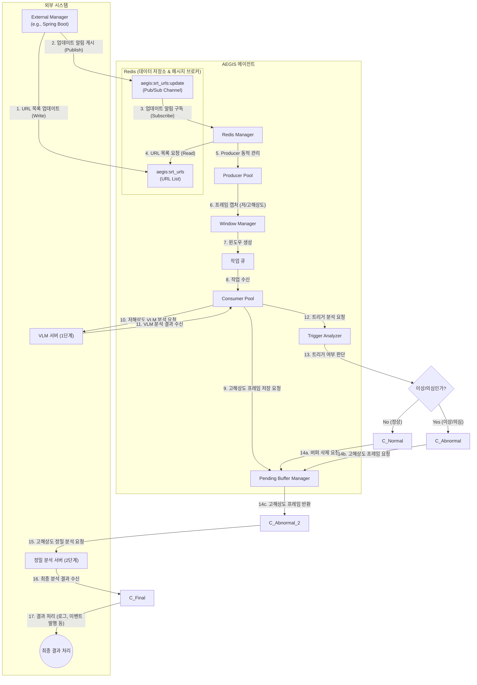

# AEGIS AI Agent

**2-Stage Triggered Analytics Pipeline - 2단계 조건부 분석 시스템**

외부 관리 서버(예: Spring Boot)가 Redis에 등록한 SRT 스트림 목록을 동적으로 관리하며, VLM 분석 결과 '이상' 조건 충족 시에만 임시 버퍼에 저장된 고해상도 프레임을 정밀 분석 API로 전송하는 안정성 중심의 파이프라인 시스템입니다.

## 🎯 시스템 개요

### 2단계 파이프라인 아키텍처
```
1단계 [VLM 트리거]  → 저해상도 → VLM 분석 → '이상' 판정
                                     ↓ (트리거 발동)
2단계 [정밀 분석] → 고해상도 → 정밀 API 전송 → 상세 분석
```

### 핵심 개념
- **2단계 분리**: `TriggerAnalyzer`가 VLM 응답을 분석하여 트리거 여부를 결정하고, `PendingBufferManager`가 VLM 분석 동안 고해상도 프레임을 안전하게 보관합니다.
- **자원 효율성**: 정상 상황에서는 고해상도 프레임을 전송하지 않아 네트워크 대역폭을 절약합니다.
- **안정성**: `PendingBufferManager`의 타임아웃 기능으로 VLM 응답 지연 시에도 메모리 누수를 방지합니다.
- **Redis 동적 스트림 관리**: 에이전트 재시작 없이 외부 관리 서버가 Redis의 설정을 변경하는 것만으로 분석할 SRT 스트림을 실시간으로 추가하거나 제거할 수 있습니다.

## 주요 기능

### 🎯 핵심 기능
- **2단계 조건부 파이프라인**: VLM 트리거 → 정밀 분석 자동 전환
- **Redis 동적 스트림 관리**: Redis Pub/Sub을 통해 SRT 스트림 목록을 실시간으로 갱신하고 Producer를 동적으로 제어
- **이중 해상도 처리**: 저해상도(VLM용) + 고해상도(정밀 분석용) 동시 캡처
- **지능형 트리거**: `TriggerAnalyzer`가 VLM 응답을 분석하여 정밀 분석 여부를 결정
- **슬라이딩 윈도우**: 여러 프레임을 하나의 분석 단위(윈도우)로 묶어 처리
- **임시 버퍼 관리**: `PendingBufferManager`가 고해상도 프레임을 타임아웃과 함께 안전하게 관리

### 🛡️ 안정성 기능
- **자동 재연결**: SRT 스트림 또는 Redis 연결 실패 시 지수 백오프(exponential backoff)를 통해 자동으로 재연결을 시도합니다.
- **메모리 안전**: `PendingBufferManager`가 타임아웃(기본 60초)된 버퍼를 자동으로 삭제하여 메모리 누수를 방지합니다.
- **큐 오버플로우 보호**: 작업 큐가 가득 차면 가장 오래된 작업을 삭제하여 시스템 과부하를 방지합니다.
- **그레이스풀 셧다운**: 시스템 종료 신호(Ctrl+C) 수신 시 모든 컴포넌트를 안전하게 종료합니다.

## 아키텍처

### 아키텍처 다이어그램 (Architecture Diagram)


**워크플로우 설명:**
1.  **URL 목록 업데이트**: 외부 관리 서버(예: Spring)가 Redis의 `aegis:srt_urls` 키에 분석할 SRT URL 목록을 저장(Write)합니다.
2.  **업데이트 알림**: 관리 서버는 URL 목록 업데이트 후, `aegis:srt_urls:update` 채널에 알림 메시지를 게시(Publish)합니다.
3.  **알림 구독**: `Redis Manager`는 에이전트 시작 시 `aegis:srt_urls:update` 채널을 구독(Subscribe)하고 있다가 알림을 수신합니다.
4.  **URL 목록 조회**: 알림을 받으면, `Redis Manager`는 Redis의 `aegis:srt_urls` 키에서 최신 URL 목록을 다시 조회(Read)합니다. (에이전트 시작 시에도 최초 1회 조회합니다.)
5.  **Producer 동적 관리**: `Redis Manager`는 조회한 URL 목록을 기반으로 `Producer` 스레드를 동적으로 시작, 중지, 또는 유지합니다.
6.  **프레임 캡처**: 각 `Producer`는 담당 SRT 스트림에서 프레임을 캡처하여 저해상도와 고해상도로 동시에 리사이즈합니다.
7.  **윈도우 생성**: `Window Manager`는 캡처된 프레임들을 모아 분석 단위인 '윈도우'를 생성하고, 저해상도 및 고해상도 프레임이 모두 포함된 작업을 `작업 큐`에 넣습니다.
8.  **작업 수신**: `Consumer` 스레드가 `작업 큐`에서 작업을 가져옵니다.
9.  **고해상도 프레임 저장**: `Consumer`는 VLM 분석을 요청하기 **전에**, `PendingBufferManager`에 고해상도 프레임을 저장하고 고유한 `buffer_id`를 받습니다.
10. **VLM 분석 요청**: `Consumer`는 저해상도 프레임들을 `VLM 서버`로 보내 1차 분석을 요청합니다.
11. **VLM 결과 수신**: `VLM 서버`로부터 분석 결과를 받습니다.
12. **트리거 분석 요청**: `Consumer`는 수신한 VLM 결과를 `TriggerAnalyzer`로 보내 트리거 여부 분석을 요청합니다.
13. **트리거 여부 판단**: `TriggerAnalyzer`가 VLM 응답을 분석하여 정밀 분석이 필요한지(`is_triggered`) 판단합니다.
14. **분기 처리**:
    *   **정상일 경우 (14a)**: `Consumer`가 `PendingBufferManager`에 `buffer_id`에 해당하는 버퍼를 삭제하도록 요청하고 작업을 종료합니다.
    *   **이상/의심일 경우 (14b, 14c)**: `Consumer`가 `PendingBufferManager`에 `buffer_id`를 사용해 저장해 두었던 고해상도 프레임을 요청하여 받아옵니다.
15. **정밀 분석 요청**: (트리거가 발동된 경우) 받아온 고해상도 프레임을 `정밀 분석 서버`로 보내 2차 분석을 요청합니다.
16. **최종 결과 수신 및 처리**: `정밀 분석 서버`로부터 최종 결과를 받아 로그를 남기거나 외부 시스템으로 이벤트를 발행합니다.

### 컴포넌트

| 컴포넌트 | 역할 |
|---------|------|
| **Redis Manager** (`redis_manager.py`) | Redis 연결, SRT URL 목록 조회, Pub/Sub을 통한 동적 스트림 관리 |
| **Producer** (`producer.py`) | 지정된 SRT 스트림에서 프레임을 캡처하고 이중 해상도로 리사이즈 |
| **Windowing** (`windowing.py`) | 프레임을 수집하여 분석 단위(윈도우)로 만들고 큐에 전송 |
| **Queue Manager** (`queue_manager.py`) | 스레드로부터 안전한 작업 큐 제공 (오버플로우 방지 기능 포함) |
| **Consumer** (`consumer.py`) | 큐에서 작업을 가져와 전체 2단계 파이프라인을 오케스트레이션 |
| **Pending Buffer Manager** (`pending_buffer_manager.py`) | VLM 분석 대기 중 고해상도 프레임을 임시 저장하고 타임아웃 관리 |
| **Trigger Analyzer** (`trigger_analyzer.py`) | VLM 응답을 분석하여 정밀 분석 트리거 여부를 결정 |
| **VLM Client** (`vlm_client.py`) | VLM 서버와의 HTTP 통신 담당 |
| **Precision Client** (`precision_client.py`) | 정밀 분석 서버와의 HTTP 통신 담당 |
| **Mock Servers** (`mock_server.py`) | 개발 및 테스트를 위한 VLM 및 정밀 분석 Mock 서버 |

## 설치 및 사용법

(설치 및 사용법은 `src` 버전과 동일하며, `--urls` 인자는 사용하지 않습니다.)

### 1. Redis 설정
에이전트 실행 전, 외부 관리 시스템이 Redis에 분석할 SRT URL 목록을 JSON 배열 형태로 저장해야 합니다.

```bash
# Redis CLI 예시
# 1. URL 목록 저장
redis-cli SET aegis:srt_urls "[\"srt://127.0.0.1:8890?streamid=cam1\"]"

# 2. 에이전트에 업데이트 알림
redis-cli PUBLISH aegis:srt_urls:update "updated"
```

### 2. 에이전트 실행
```bash
# Mock 서버와 함께 테스트 실행
python -m src_backup.main --mock --log-level INFO

# 실제 운영 환경에서 실행
python -m src_backup.main --workers 4 --vlm-endpoint <VLM_API_URL> --precision-endpoint <PRECISION_API_URL>
```

## CLI 인자
`--urls` 인자는 제거되었으며, 나머지 인자( `--workers`, `--mock` 등)는 동일하게 사용할 수 있습니다. 모든 스트림 정보는 Redis를 통해 관리됩니다.
