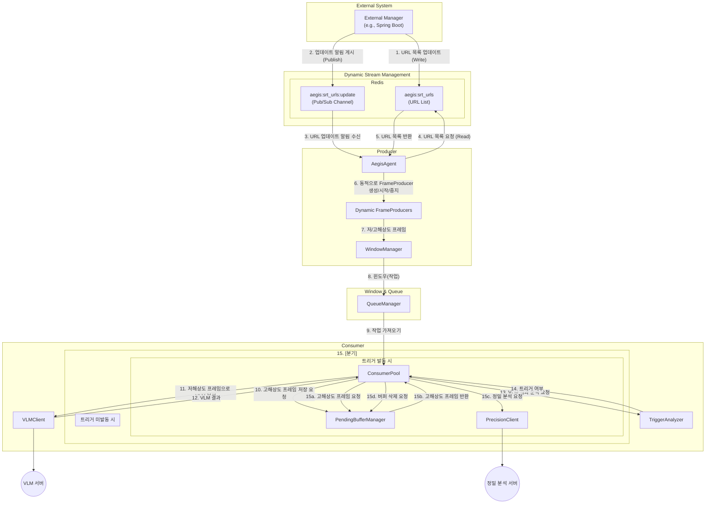
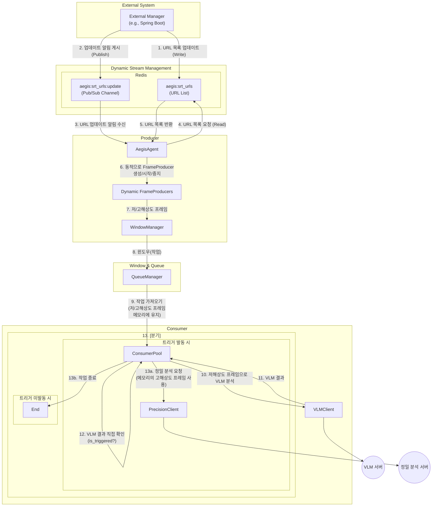

# AEGIS-AI-Agent 워크플로우 비교 분석 (src vs. src_backup)

이 문서는 `aegis-ai-agent` 프로젝트의 `src`와 `src_backup` 디렉토리에 포함된 코드의 워크플로우 차이점을 설명합니다. 두 버전 모두 **Redis Pub/Sub을 통해 SRT 스트림 URL을 동적으로 관리**하는 기능을 공통으로 포함하고 있습니다.

## 전체 아키텍처 비교

두 워크플로우의 가장 큰 차이점은 `Consumer`가 VLM 분석 결과를 처리하는 방식에 있으며, 스트림 소스를 관리하는 방식은 동일합니다.

외부 관리 서버(예: Spring Boot)가 Redis에 SRT URL 목록을 업데이트하면, `AegisAgent`가 이를 감지하여 동적으로 스트림 처리를 시작하거나 중지합니다.

### `src_backup` (2단계 분리형 아키텍처)

`PendingBufferManager`와 `TriggerAnalyzer`를 통해 역할을 분리하고 상태를 관리하여 안정성을 높인 구조입니다.

### `src` (간소화된 인라인 아키텍처)

`Consumer` 내부에서 모든 로직을 직접 처리하여 구조를 단순화한 경량 구조입니다.

---

## 1. `src_backup` (2단계 분리형 워크플로우)

`src_backup`은 **상태 관리**와 **역할 분리**에 중점을 둔 안정적인 아키텍처입니다.

### 진행 순서

1.  **스트림 소스 관리 (동적)**: 외부 관리 서버(예: Spring)가 Redis에 SRT URL 목록을 업데이트하고 알림을 보냅니다. `AegisAgent`는 이를 감지하여 Redis에서 최신 URL 목록을 가져와 `FrameProducer`들을 동적으로 시작하거나 중지합니다.
2.  **프레임 생산 및 윈도잉**: 각 `FrameProducer`가 스트림에서 프레임을 캡처하여 `WindowManager`로 보냅니다. `WindowManager`는 프레임을 윈도우 단위로 묶어 `QueueManager`에 작업을 전달합니다.
3.  **작업 수신**: `Consumer`가 큐에서 저해상도와 고해상도 프레임이 모두 포함된 작업을 가져옵니다.
4.  **고해상도 프레임 저장**: `PendingBufferManager`에 고해상도 프레임 리스트를 전달하고, 고유한 `buffer_id`를 받습니다.
5.  **1단계 분석 (VLM)**: 저해상도 프레임 리스트만 `VLMClient`를 통해 VLM 서버로 전송하여 분석을 요청합니다.
6.  **트리거 분석**: VLM 서버로부터 받은 응답을 `TriggerAnalyzer`로 보내 정밀 분석이 필요한지 여부(`is_triggered`)를 판단합니다.
7.  **분기 처리**:
    -   **[트리거 발동 시]**: `PendingBufferManager`에서 `buffer_id`를 사용해 저장해 두었던 고해상도 프레임을 다시 가져옵니다.
    -   **[트리거 미발동 시]**: `PendingBufferManager`에 `buffer_id`에 해당하는 버퍼를 삭제하라고 알려 작업을 종료합니다.
8.  **2단계 분석 (정밀 분석)**: (트리거가 발동된 경우) 가져온 고해상도 프레임을 `PrecisionClient`를 통해 정밀 분석 서버로 전송합니다.

### 특징

- **안정성**: 고해상도 프레임이 별도의 관리형 버퍼에 저장되므로, VLM 분석이 지연되더라도 데이터가 유실되거나 메모리에 과도하게 쌓이지 않습니다. (`buffer_timeout` 설정으로 자동 정리)
- **역할 분리**: `Consumer`는 작업 조율, `TriggerAnalyzer`는 분석, `PendingBufferManager`는 데이터 저장을 담당하여 각 컴포넌트의 책임이 명확합니다.
- **복잡성**: 상태를 관리하기 위한 컴포넌트가 추가되어 코드의 복잡성이 다소 높습니다.

---

## 2. `src` (간소화된 인라인 워크플로우)

`src`는 `src_backup`의 핵심 아이디어를 유지하되, 중간 과정을 단순화하여 경량으로 만든 아키텍처입니다.

### 핵심 컴포넌트

- `PendingBufferManager`와 `TriggerAnalyzer`가 **제거되었습니다.**
- 모든 로직이 `Consumer` 내에서 인라인(inline)으로 처리됩니다.

### 진행 순서

1.  **스트림 소스 관리 (동적)**: 외부 관리 서버(예: Spring)가 Redis에 SRT URL 목록을 업데이트하고 알림을 보냅니다. `AegisAgent`는 이를 감지하여 Redis에서 최신 URL 목록을 가져와 `FrameProducer`들을 동적으로 시작하거나 중지합니다.
2.  **프레임 생산 및 윈도잉**: 각 `FrameProducer`가 스트림에서 프레임을 캡처하여 `WindowManager`로 보냅니다. `WindowManager`는 프레임을 윈도우 단위로 묶어 `QueueManager`에 작업을 전달합니다.
3.  **작업 수신**: `Consumer`가 큐에서 작업을 가져와 저해상도와 고해상도 프레임을 모두 **자신의 메모리에 유지**합니다.
4.  **1단계 분석 (VLM)**: 저해상도 프레임 리스트를 `VLMClient`를 통해 VLM 서버로 전송하여 분석을 요청합니다.
5.  **트리거 결정**: VLM 서버로부터 받은 응답의 `primary_category` 값을 `Consumer`가 **직접 확인**하여 트리거 발동 여부(`is_triggered`)를 결정합니다.
6.  **분기 처리**:
    -   **[트리거 발동 시]**: `Consumer`가 메모리에 가지고 있던 고해상도 프레임을 `PrecisionClient`를 통해 정밀 분석 서버로 즉시 전송합니다.
    -   **[트리거 미발동 시]**: 아무것도 하지 않고 작업을 종료합니다. (메모리에 있던 프레임은 가비지 컬렉션 대상이 됨)

### 특징

- **단순성**: 별도의 버퍼나 분석기 없이 `Consumer` 내에서 모든 로직이 순차적으로 처리되므로 코드가 단순하고 이해하기 쉽습니다.
- **메모리 관리**: VLM 분석이 진행되는 동안 고해상도 프레임이 `Consumer` 워커 스레드의 메모리에 계속 상주합니다. VLM 응답이 빠르면 문제가 없지만, 지연될 경우 메모리 사용량이 일시적으로 증가할 수 있습니다.
- **결합도**: 데이터 처리와 결정 로직이 `Consumer`에 모두 결합되어 있어 역할 분리 측면에서는 `src_backup`보다 약합니다.

## 주요 차이점 요약

| 구분 | `src_backup` (분리형) | `src` (간소화) |
| --- | --- | --- |
| **스트림 관리** | Redis Pub/Sub 기반 동적 관리 (공통) | Redis Pub/Sub 기반 동적 관리 (공통) |
| **핵심 컴포넌트** | `PendingBufferManager`, `TriggerAnalyzer` 포함 | 해당 컴포넌트 없음 |
| **고해상도 프레임 처리** | 별도의 **버퍼**에 저장 후 ID로 관리 | `Consumer` **메모리**에 계속 유지 |
| **트리거 결정 로직** | `TriggerAnalyzer`가 VLM 응답을 **분석** | `Consumer`가 VLM 응답을 **직접 확인** |
| **아키텍처 복잡성** | 높음 | 낮음 |
| **안정성 및 유연성** | 높음 (지연 처리, 타임아웃에 강함) | 낮음 (빠른 응답에 의존적) |
